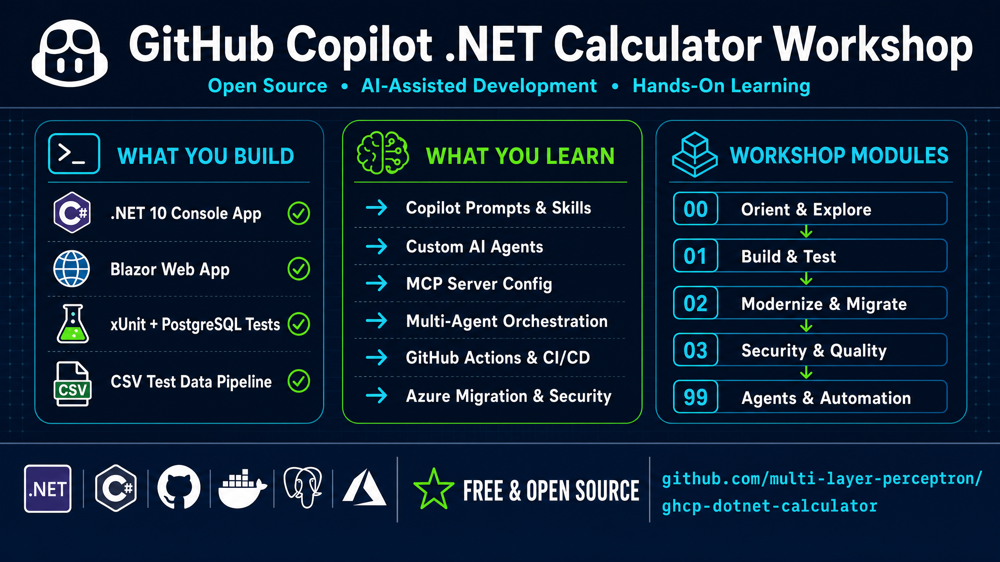
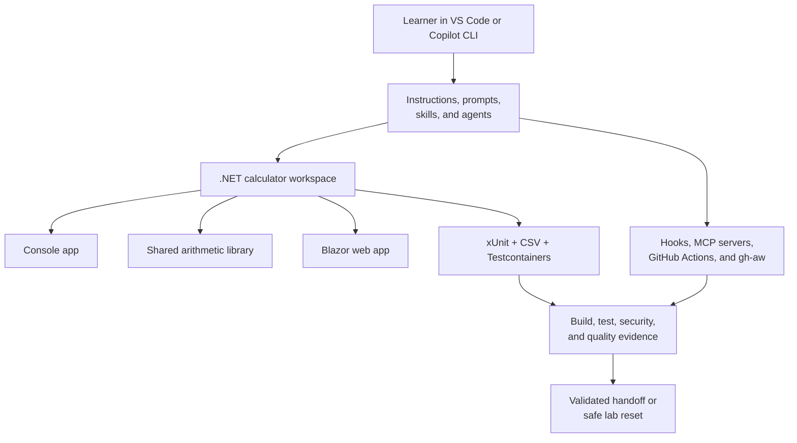
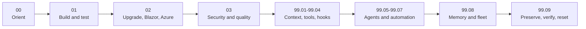
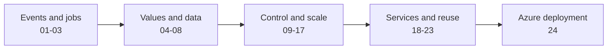
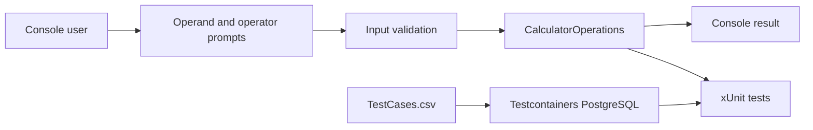
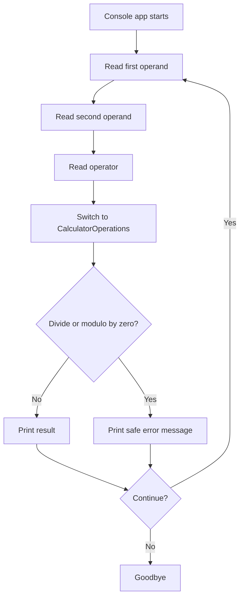
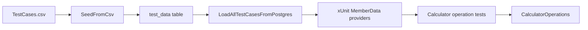

## Overview

GitHub Copilot learning workspace for a small .NET 10 calculator lab.

[License: MIT](LICENSE) [.NET 10](https://dotnet.microsoft.com/) [xUnit](https://xunit.net/) [Testcontainers](https://testcontainers.com/) [GitHub Copilot](https://github.com/features/copilot)

This repository contains a compact calculator workspace for practicing GitHub
Copilot-assisted development, testing, refactoring, prompt workflows, and
incremental modernization. The app shows how a small console program can expose
arithmetic operations, input validation, divide-by-zero handling, CSV-backed test
data, Testcontainers-backed PostgreSQL seeding, and repeatable setup prompts.

The implementation is intentionally small rather than production-deep. It gives
participants a realistic but approachable codebase for practicing GitHub Flow,
debugging, refactoring, unit testing, documentation, GitHub Actions concepts, and
custom Copilot prompt and skill authoring.





The calculator is the practice surface, while the surrounding Copilot and
automation assets teach how context, tools, guardrails, and validation compose
into a complete AI-assisted development workflow.

## Lab Use Notice

This repository is an educational lab and workshop sandbox. It is not designed,
security-reviewed, performance-tested, or supported for production use. Do not
deploy it to production or use it to process real, confidential, regulated, or
business-critical data without first performing your own architecture, security,
privacy, compliance, operational, and legal review.

The examples may use development-oriented defaults, local containers, sample
configuration, and training workflows that are not appropriate for a production
environment. You are responsible for validating any derivative work, managing
credentials and access, applying security controls, and meeting the requirements
that apply to your organization and intended use. This notice complements, and
does not replace, the warranty and liability terms in the [MIT License](LICENSE).

## Community And Participation

We welcome learners, facilitators, maintainers, and focused open-source
contributions. Use the channel that matches your need:

| Need | Start here |
| --- | --- |
| Setup, exercise, or usage question | [GitHub Discussions](https://github.com/multi-layer-perceptron/ghcp-dotnet-calculator/discussions) |
| Idea or substantial proposal | [GitHub Discussions](https://github.com/multi-layer-perceptron/ghcp-dotnet-calculator/discussions) |
| Reproducible defect or lab correction | [GitHub Issues](https://github.com/multi-layer-perceptron/ghcp-dotnet-calculator/issues) |
| Focused pull request | [Contributing guide](CONTRIBUTING.md) |
| Suspected vulnerability | Private process in [Security policy](SECURITY.md) |
| Conduct concern | Private process in [Code of Conduct](CODE_OF_CONDUCT.md) |

Support is community-based and best effort; see [SUPPORT.md](SUPPORT.md) for
scope and routing. Maintainers can use [DISCUSSIONS_SETUP.md](DISCUSSIONS_SETUP.md)
to configure Announcements, Q&A, Ideas, and Show and tell categories.

The [participation terms requirements brief](PARTICIPATION_TERMS_REQUIREMENTS.md)
records topics for qualified legal review. It is not operative terms and has
not been adopted as a condition of repository use or participation.

## Acknowledgments

This lab was inspired by the following resources:

- [A Day in the Life with GitHub Copilot - Hands-On Lab](https://github.com/ms-mfg-community/day-in-the-life-copilot-lab)
- [GitHub Copilot Dev Days](https://copilot-dev-days.github.io/#workshops)

Special thanks, appreciation and gratitude to the Microsoft and GitHub teams for their support of these workshops for their learning materials and community contributions, as well as for you the learner for your participation and feedback. We hope you enjoy the lab and find it useful for your own learning and development as we accelerate the adoption of GitHub Copilot and AI-assisted development workflows.

## Prerequisites

### Must-Have Now

| Tool | Why you need it |
| ---- | --------------- |
| GitHub account | Required to fork, clone, open Codespaces, and use Copilot-assisted workshop flows. |
| Git | Required to clone the repository, create branches, and practice GitHub Flow. |
| VS Code | Recommended editor for the workspace, reusable prompt files, and Copilot Chat. |
| .NET 10 SDK | Required to restore, build, test, and run the calculator locally. |
| Docker Desktop | Required for the Testcontainers PostgreSQL-backed test data workflow. |
| Node.js LTS | Required for MCP-related exercises that use `npx` to run local MCP server configurations. |
| GitHub Copilot | Recommended for the workshop exercises; the calculator can build and run without Copilot. |

### Additional Tools By Path

| Path | Additional tools |
| ---- | ---------------- |
| GitHub Codespaces | Browser or VS Code access. The repository dev container supplies the required runtimes, CLIs, caches, and extensions. |
| Local Windows, macOS, or Linux setup | .NET 10 SDK, Git, VS Code, Docker Desktop, and Node.js LTS for MCP `npx` workflows. |
| Manual PowerShell validation | PowerShell 7, .NET 10 SDK, Docker Desktop, and repository write access. |
| GitHub Actions practice | GitHub CLI is optional, but useful for creating issues, branches, and pull requests from the terminal. |
| Copilot workshop flows | A Copilot-enabled GitHub account and access to Copilot Chat in VS Code. |

### Hide The Completed Solution

Before starting the lab exercises, hide the `src/completed/` folder from your
working context. That folder contains the finished reference solution, and if
it stays visible, GitHub Copilot can draw on it while you work, which
inadvertently interferes with the integrity and the learning process of
building the same solution yourself through the lab exercises.

Use one of the following approaches:

- **.gitignore (any Copilot SKU):** in your fork, delete or move the
  `src/completed/` folder out of the repository and add an entry to
  [.gitignore](.gitignore) so it is never re-committed:

  ```gitignore
  # Hide the completed reference solution during lab exercises
  src/completed/
  ```

  Note that `.gitignore` only affects untracked files. If `src/completed/` is
  already tracked in your fork, remove it from the index first with
  `git rm -r --cached src/completed`, commit, and keep a copy outside the
  repository for later comparison.

- **Content Exclusion (GitHub Copilot Enterprise SKU):** if your organization
  has Copilot Enterprise, an administrator can configure the
  [Content Exclusion](https://docs.github.com/en/copilot/managing-copilot/configuring-and-auditing-content-exclusion)
  feature for the repository so Copilot never reads the folder, without
  changing the repository contents. Add a repository-level exclusion such as:

  ```yaml
  "*":
    - "src/completed/**"
  ```

Either way, the completed solution stays available to facilitators for
reference while participants build their own solution from a clean slate.

### Local Setup Preflight

When running locally, first open the repository in VS Code and confirm the .NET
SDK is available:

```bash
dotnet --info
```

Then restore, build, and test the calculator solution before starting an
exercise:

```bash
dotnet restore src/workspace/calculator-xunit-testing/calculator.slnx
dotnet build src/workspace/calculator-xunit-testing/calculator.slnx --no-restore
dotnet test src/workspace/calculator-xunit-testing/calculator.slnx --no-build
```

### Permissions And Licensing

| Activity | Requirement |
| -------- | ----------- |
| Run validation commands | Read access to this repository and permission to run local developer tools. |
| Run Testcontainers tests | Docker daemon access on the local machine or development container. |
| Use Codespaces | Codespaces enabled for your GitHub account or organization. |
| Fork for workshop edits | Permission to fork public repositories, or permission to create a copy inside your organization. |
| Push changes or open PRs | Write access to your fork or target repository. |
| Use GitHub Copilot | Copilot Individual, Business, Enterprise, or another license assigned by your organization. |

If your organization restricts Codespaces, Copilot, Docker, GitHub Actions, or
third-party extensions through policy, confirm those features with your
administrator before the workshop. This repository is licensed under [MIT](LICENSE).

## Choose Your Path

| Path | Typical time | Best for | Status |
| ---- | ------------ | -------- | ------ |
| GitHub Codespaces | 5-10 min | Participants who want the least local setup | Supported when .NET 10 and Docker are available |
| Local VS Code setup | 10-15 min | Participants who already have .NET and Docker installed | Recommended |
| Manual PowerShell validation | 10-15 min | Windows users validating from PowerShell | Supported |
| Facilitator walkthrough | 15-20 min | Instructors leading setup, test execution, and first calculator run | Supported |

### Option A - GitHub Codespaces

1. Fork the repository into your account or an approved organization.
2. Open your fork and confirm the owner name in the repository URL.
3. Select Code > Codespaces > Create codespace on main.
4. Wait for the environment to finish loading. The first setup can take a few
   minutes.
5. Confirm the post-create task reports `Codespaces toolchain validation
  completed`.
6. Open a terminal and continue with Validate The Stack.

Use the [Codespaces setup and lifecycle guide](docs/codespaces-guide.md) to
select account preferences and machine capacity, verify your fork and
toolchain, enable Actions, authenticate CLIs, manage caches and prebuilds, open
the Blazor port, preserve work, and stop or delete the Codespace safely.

### Option B - Local VS Code Setup

1. Install [VS Code](https://code.visualstudio.com/), Git, the [.NET 10 SDK](https://dotnet.microsoft.com/download/dotnet/10.0), and Docker Desktop.
2. Clone or fork the repository using Fork And Clone.
3. Open the repository folder in VS Code.
4. Run `dotnet --info` in the integrated terminal.
5. Start Docker Desktop.
6. Continue with Validate The Stack.

### Option C - Manual PowerShell Validation

Use this path when you want to run setup, tests, and the console calculator from
PowerShell.

1. Install Git for Windows, PowerShell 7, Docker Desktop, and the [.NET 10 SDK](https://dotnet.microsoft.com/download/dotnet/10.0).
2. Open a new PowerShell terminal so PATH changes are loaded.
3. Verify the SDK:

   ```powershell
   dotnet --info
   ```

4. Clone or fork the repository using Fork And Clone.
5. Open the repository in VS Code.
6. Run the commands in Validate The Stack.

### Option D - Facilitator Walkthrough

Use this path when you are leading the workshop and want all participants to
start from the same checkpoints.

1. Confirm every participant can open the repository in Codespaces or local VS
   Code.
2. Ask participants to run `dotnet test src/workspace/calculator-xunit-testing/calculator.slnx` before making changes.
3. Walk through the setup, implementation, testing, CSV, PostgreSQL, and .NET
   upgrade prompts in order.
4. Start with a small scoped change, then review the generated diff and test
   results together.

## Fork And Clone

Forking is recommended when you plan to edit the repository, open pull requests,
or use it as a workshop sandbox.

1. On GitHub, select Fork.
2. Clone your fork:

   ```bash
   git clone https://github.com/YOUR-USERNAME/ghcp-dotnet-calculator.git
   cd ghcp-dotnet-calculator
   ```

3. Verify the solution builds:

   ```bash
   dotnet build src/workspace/calculator-xunit-testing/calculator.slnx
   ```

If your organization uses GitHub Enterprise Managed Users and cannot fork
external repositories, create an empty repository in your allowed namespace,
clone this source repository, then change `origin` to your new repository:

```bash
git clone https://github.com/multi-layer-perceptron/ghcp-dotnet-calculator.git
cd ghcp-dotnet-calculator
git remote set-url origin https://github.com/YOUR-ORG-OR-USER/ghcp-dotnet-calculator.git
git push --all origin
git push --tags origin
```

## Getting Started Tutorial

### Validate The Stack

Run these commands from the repository root. Codespaces and properly configured
local environments should both support the same solution commands.

In Codespaces, first rerun the repository preflight when the post-create log is
unavailable or the container was rebuilt:

```bash
bash .devcontainer/scripts/post-create.sh
```

### .NET Calculator Workflow

```bash
dotnet restore src/workspace/calculator-xunit-testing/calculator.slnx
dotnet build src/workspace/calculator-xunit-testing/calculator.slnx --no-restore
dotnet test src/workspace/calculator-xunit-testing/calculator.slnx --no-build
```

Expected result: the solution restores, builds, and the xUnit tests pass across
addition, subtraction, multiplication, division, modulo, exponentiation,
divide-by-zero handling, CSV loading, and PostgreSQL-backed test data seeding.

### Run The Console App

```bash
dotnet run --project src/workspace/calculator-xunit-testing/calculator/calculator.csproj
```

Expected result: the console app prompts for two operands and one operator. It
supports `+`, `-`, `*`, `/`, `%`, and `^`, then asks whether to perform another
calculation.

### Review The Test Data

The test project copies `TestCases.csv` to the test output directory and seeds a
temporary PostgreSQL container from it during automated tests.

```bash
cat src/workspace/calculator-xunit-testing/calculator.tests/TestCases.csv
```

Expected result: the CSV lists arithmetic operation rows with `Operand1`,
`Operand2`, `Operation`, and `ExpectedResult` columns.

### Prompt Workflow Tour

The `.github/prompts/` directory contains reusable prompt files that walk through
the staged calculator workflow:

```text
1.12.1-solution-setup.prompt.md
1.12.2-calculator-implementation.prompt.md
1.12.3-refactor-steps.prompt.md
1.12.4-testing-strategy.prompt.md
2.01-create-csv-test-dataset.prompt.md
2.02-convert-csv-test-data-to-postgresql-container.prompt.md
2.03-switch-test-data-to-pg.prompt.md
3.01-upgrade-dotnet-from-8-to-10.prompt.md
```

## Lab Exercises

The [lab exercise guide](lab-exercises/README.md) explains how the guided
exercises translate the staged prompt workflows into a progressive lab. The
flat folder layout is intentional: modules are logical curriculum groups, not
subdirectories. Exercise identifiers use a dotted-decimal
`module.exercise` scheme based on the progression logic of the prompts: build
first, then modernize, then validate quality and security. The catalog below
lists each exercise, its associated prompt, and its place in that sequence.

Complete the [Hide The Completed Solution](#hide-the-completed-solution)
prerequisite before starting [Exercise 01.01](lab-exercises/01.01-solution-setup.md).
Start with [Exercise 00.01](lab-exercises/00.01.explore-copilot-config-files.md)
if you want a short tour of the Copilot configuration files that drive the lab
sequence.



Read the journey from left to right. Each module preserves a usable result for
the next one; destructive cleanup remains the final exercise.

### Module 00 - Explore The Copilot Workspace

| Exercise | Title | Associated prompt |
| -------- | ----- | ----------------- |
| [00.01](lab-exercises/00.01.explore-copilot-config-files.md) | Explore Copilot Configuration Files | None |
| [00.02](lab-exercises/00.02.create-dotnet-dev-agent.md) | Create A .NET Development Agent | None |

### Module 01 - Build The Calculator Solution

| Exercise | Title | Associated prompt |
| -------- | ----- | ----------------- |
| [01.01](lab-exercises/01.01-solution-setup.md) | Solution Setup | `1.12.1-solution-setup` |
| [01.02](lab-exercises/01.02-calculator-implementation.md) | Calculator Implementation | `1.12.2-calculator-implementation` |
| [01.03](lab-exercises/01.03-refactoring-steps.md) | Refactoring Steps | `1.12.3-refactor-steps` |
| [01.04](lab-exercises/01.04-testing-strategy.md) | Testing Strategy | `1.12.4-testing-strategy` |
| [01.05](lab-exercises/01.05-full-solution-walkthrough.md) | Optional Full Baseline Walkthrough | `1.12-implement-full-calculator-solution` |

### Module 02 - Modernize And Migrate

| Exercise | Title | Associated prompt |
| -------- | ----- | ----------------- |
| [02.01](lab-exercises/02.01-upgrade-dotnet-8-to-10.md) | Upgrade .NET 8 To .NET 10 | `3.01-upgrade-dotnet-from-8-to-10` |
| [02.02](lab-exercises/02.02-refactor-to-blazor.md) | Refactor To A Blazor Web App | `3.01.1-refactor-calculator-blazor-app` |
| [02.03](lab-exercises/02.03-azure-migration-assessment.md) | Azure Migration Assessment | `3.02-migrate-to-azure` |

### Module 03 - Quality, Security, And Wrap-Up

| Exercise | Title | Associated prompt |
| -------- | ----- | ----------------- |
| [03.01](lab-exercises/03.01-security-assessment.md) | Security Assessment | `7.01-conduct-security-assessment` |
| [03.02](lab-exercises/03.02-comprehensive-quality-gate.md) | Comprehensive Quality Gate | `12.00.test-for-quality` |
| [03.03](lab-exercises/03.03-final-validation-and-handoff.md) | Final Validation And Handoff | None |

### Module 99 - Finished Project Customization

Use these exercises only after completing the current exercise set from `00.01`
through `03.03` and confirming the completed project exists under
`src/workspace/calculator-xunit-testing/`.

Exercise 99.03 uses the `configure-mcp-servers` skill to configure Azure
DevOps, GitHub, Microsoft Learn, Playwright, and Memory. Its Azure DevOps
example uses `autocloudarc-mcaps`; learners substitute their own organization
value in the `https://mcp.dev.azure.com/{organization}` endpoint pattern.

| Exercise | Title | Associated prompt |
| -------- | ----- | ----------------- |
| [99.01](lab-exercises/99.01.custom-instructions-and-agents.md) | Custom Instructions And Agents | None |
| [99.02](lab-exercises/99.02.skills-and-prompts.md) | Skills And Prompts | None |
| [99.03](lab-exercises/99.03.mcp-server-configuration.md) | MCP Server Configuration | None |
| [99.04](lab-exercises/99.04.create-hooks.md) | Create Hooks | None |
| [99.05](lab-exercises/99.05.multi-agent-orchestration.md) | Multi-Agent Orchestration | None |
| [99.06](lab-exercises/99.06.github-agentic-workflows.md) | GitHub Agentic Workflow Diagnostics | None |
| [99.07](lab-exercises/99.07.copilot-coding-agent-code-review.md) | Copilot Coding Agent And Code Review | None |
| [99.08](lab-exercises/99.08.capstone-exercises.md) | Capstone Exercises | None |
| [99.09](lab-exercises/99.09.reset-environments.md) | Reset Azure And Local Environments | `reset-calculator-lab` skill, `3.03-reset-azure-environment`, `3.04-reset-local-docker-pg` |

## GitHub Actions Workflow Labs

The [GitHub Actions workflow track](workflow-exercises/README.md) provides a
second, independent learning path built from the repository's numbered workflow
examples and their natural-language Copilot prompts. Run this track from your
own fork so experiments, settings, environments, secrets, and runner usage stay
under your control.

Codespaces learners should complete the
[Codespaces setup and lifecycle guide](docs/codespaces-guide.md) first. The
Codespace is the authoring environment; GitHub-hosted runners execute the
workflows after reviewed changes are committed and pushed to the fork.



The track progresses from basic triggers to cross-repository reusable workflows
and an advanced, opt-in Azure deployment. Workflows 22 and 23 require external
caller repositories to demonstrate their trust boundaries authentically.
Workflow 24 requires pre-provisioned, billable Azure state storage, and apply
creates additional persistent resources. Review each lesson's permissions,
cost, state-security, and cleanup guidance before running it.

## Calculator Tutorial

The console calculator is the workshop's main hands-on surface. It walks
participants through the same path the tests exercise: read operands, choose an
operator, execute pure arithmetic operations, handle invalid input, and validate
behavior with repeatable tests.

### Calculator Workflow Diagram



### Step 1 - Perform Arithmetic

Purpose: exercise the calculator operations from the console app or direct unit
tests.

How to use it:

1. Start the console app.
2. Enter the first number.
3. Enter the second number.
4. Choose one of `+`, `-`, `*`, `/`, `%`, or `^`.

What this step produces: a calculated result from the corresponding
`CalculatorOperations` method.

### Step 2 - Handle Invalid Input

Purpose: practice safe console input validation and user feedback.

How to use it:

1. Enter non-numeric text when prompted for an operand.
2. Enter an unsupported operator.
3. Divide or modulo by zero.
4. Continue or exit using `y` or `n`.

What this step produces: clear validation messages without crashing the console
session.

### Step 3 - Validate With CSV-Backed Tests

Purpose: separate test data from test code and make arithmetic coverage easy to
extend.

How to use it:

1. Add a row to `TestCases.csv` with operands, operation name, and expected
   result.
2. Run `dotnet test src/workspace/calculator-xunit-testing/calculator.slnx`.
3. Confirm the matching `[MemberData]` theory consumes the new row.

What this step produces: a repeatable xUnit test case generated from structured
CSV data.

### Step 4 - Validate PostgreSQL Test Data Loading

Purpose: practice containerized dependency testing without requiring a shared
database.

How to use it:

1. Start Docker Desktop.
2. Run the xUnit test suite.
3. Let Testcontainers create a temporary PostgreSQL container.
4. Confirm the tests seed and query the `test_data` table.

What this step produces: deterministic test data loaded through PostgreSQL for
the duration of the test run.

### Glossary For Workshop Participants

These terms appear throughout the calculator code, tests, docs, and exercises.
They are deliberately small because the lab is designed for learning rather than
domain complexity.

| Term | Meaning |
| ---- | ------- |
| Console calculator | A command-line app that prompts for operands and an operator. |
| Operand | A numeric input used by an arithmetic operation. |
| Operator | A symbol such as `+`, `-`, `*`, `/`, `%`, or `^` that selects an operation. |
| CalculatorOperations | Static C# class containing pure arithmetic methods. |
| CSV test data | Structured rows in `TestCases.csv` that drive parameterized tests. |
| xUnit | Test framework used by the calculator test project. |
| MemberData | xUnit data source pattern used to feed theory tests. |
| Testcontainers | Library used to create temporary PostgreSQL containers for automated tests. |
| PostgreSQL seed table | Runtime `test_data` table populated from the CSV file during tests. |
| Reusable prompt file | A `.prompt.md` file that gives Copilot repeatable instructions for a common task. |
| Skill | A reusable Copilot workflow package with guidance, scripts, and templates. |

## Useful Commands

| Task | Command |
| ---- | ------- |
| Restore packages | `dotnet restore src/workspace/calculator-xunit-testing/calculator.slnx` |
| Build solution | `dotnet build src/workspace/calculator-xunit-testing/calculator.slnx` |
| Run tests | `dotnet test src/workspace/calculator-xunit-testing/calculator.slnx` |
| Run console app | `dotnet run --project src/workspace/calculator-xunit-testing/calculator/calculator.csproj` |
| Recreate workspace | `pwsh -NoProfile -ExecutionPolicy Bypass -File src/workspace/Set-DotnetSlnForCalculator.ps1` |
| Preview generated-workspace reset | `pwsh .github/skills/reset-calculator-lab/scripts/Remove-DotnetSlnForCalculator.ps1 -WhatIf` |
| Install GitHub Agentic Workflows CLI | `gh extension install github/gh-aw` |
| Upgrade GitHub Agentic Workflows CLI | `gh extension upgrade github/gh-aw` |
| Compile 99.06 agentic workflow | `gh aw compile --strict .github/workflows/99.06.workflow-failure-doctor.md` |
| Check 99.06 agentic workflow status | `gh aw status 99.06.workflow-failure-doctor` |
| Run 99.06 agentic workflow | `gh aw run 99.06.workflow-failure-doctor` |
| Check repository status | `git status --short --branch` |

## Project Layout

```text
ghcp-dotnet-calculator/
  README.md                                      Repository overview and workshop quickstart
  LICENSE                                        MIT license
  azure.yaml                                     Azure Developer CLI metadata for later migration stages
  docs/
    prd-csharp-basic-calculator-solution.md      Calculator product requirements
    azure-migration-assessment-3.02.md           Azure migration assessment notes
  lab-exercises/
    00.01.explore-copilot-config-files.md        Copilot configuration orientation exercise
    00.02.create-dotnet-dev-agent.md             Custom .NET development agent exercise
    01.01-solution-setup.md                      Module 01-03 guided lab exercises
    99.01.custom-instructions-and-agents.md      Finished project customization exercise
    99.02.skills-and-prompts.md                  Finished project skills and prompts exercise
    99.03.mcp-server-configuration.md            Finished project MCP configuration exercise
    99.04.create-hooks.md                        Finished project .NET build hook exercise
    99.05.multi-agent-orchestration.md           Finished project multi-agent orchestration exercise
    99.06.github-agentic-workflows.md            Finished project agentic workflow diagnostics exercise
    99.07.copilot-coding-agent-code-review.md    Finished project Copilot coding agent repair exercise
    99.08.capstone-exercises.md                  Finished project capstone: indexing, memory, and advanced features
  workflow-exercises/
    README.md                                    GitHub Actions workflow track catalog and safety guidance
    01-basic-triggers-workflow.md                Workflow lesson mapped to the matching numbered YAML
    24-deploy-resources-workflow.md              Advanced OIDC and Terraform deployment lesson
  src/
    workspace/
      Set-DotnetSlnForCalculator.ps1             Setup script for the active calculator workspace
      calculator-xunit-testing/
        calculator.slnx                          .NET solution
        calculator/
          Calculator.cs                          Console workflow and input handling
          calculator.csproj                      .NET 10 console app project
        calculator.library/
          CalculatorOperations.cs                Pure arithmetic operations
          calculator.library.csproj              Shared .NET 10 class library
        calculator.tests/
          CalculatorTest.cs                      xUnit v3 tests with PostgreSQL-backed data loading
          TestCases.csv                          Arithmetic test dataset
          calculator.tests.csproj                .NET 10 xUnit test project
        calculator.web/
          Components/                            Blazor pages, layout, and calculator controls
          Services/                              Calculator state, formatting, history, and theme
          calculator.web.csproj                  .NET 10 Blazor web project
  .github/
    copilot-instructions.md                      Repository-specific Copilot guidance
    hooks/                                       Copilot lifecycle hook configuration (default.json)
    prompts/                                     Reusable Copilot prompt files
    skills/                                      Reusable Copilot skill packages
      create-session-handoff/                    Recoverable cross-session handoff workflow
      reset-calculator-lab/                      Final lab reset skill and bundled cleanup script
    workflows/                                   GitHub Actions workflow examples
      99.06.workflow-failure-doctor.md           GitHub Agentic Workflow diagnostic example
      99.06.workflow-failure-doctor.lock.yml      Compiled GitHub Actions workflow for 99.06
      shared/                                    Shared agentic workflow components imported at compile time
  scripts/
    hooks/                                       Lifecycle hook scripts (observation, secret scan, .NET build check)
```

## Control Flow



## Data Flow



## Implemented Workflow

1. Create or verify the .NET calculator solution structure.
2. Implement the interactive console calculator.
3. Refactor arithmetic behavior into testable operations.
4. Add xUnit coverage for normal and error cases.
5. Move parameterized test data into `TestCases.csv`.
6. Seed PostgreSQL test data from CSV for automated tests.
7. Use Testcontainers to create isolated PostgreSQL instances per test run.
8. Upgrade the active calculator workspace from .NET 8 to .NET 10.
9. Run build and test validation after each staged prompt.
10. Capture reusable workflows as prompts and skills.
11. Configure and compile the 99.06 GitHub Agentic Workflow diagnostic example.

## Key Documentation

- [Calculator PRD](docs/prd-csharp-basic-calculator-solution.md)
- [Azure migration assessment](docs/azure-migration-assessment-3.02.md)
- [Solution setup prompt](.github/prompts/1.12.1-solution-setup.prompt.md)
- [Calculator setup skill](.github/skills/calculator-setup/SKILL.md)
- [CSV test dataset skill](.github/skills/create-csv-test-dataset/SKILL.md)
- [PostgreSQL container skill](.github/skills/convert-csv-test-data-to-postgresql-container/SKILL.md)
- [Configure MCP servers skill](.github/skills/configure-mcp-servers/SKILL.md)

## Notes For Workshop Facilitators

- The project is intentionally compact and uses calculator behavior rather than
  a domain-heavy business model.
- The active workspace is a .NET 10 console app plus xUnit test project.
- Docker must be running before the Testcontainers-backed tests execute.
- The CSV file remains the human-editable source for arithmetic test cases.
- The PostgreSQL container is temporary for automated tests and is cleaned up at
  process shutdown.
- The prompt files are staged so participants can practice one workflow at a
  time.
- Prefer small, readable changes over broad rewrites during workshop exercises.

## License

[MIT](LICENSE)
