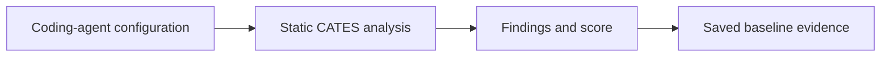

## CATES 01 - Foundations And Baseline

**Track:** CATES Learning Track
**Workspace:** [sample-repository](workspace/sample-repository/README.md)
**Associated prompt:** [14.01-cates-foundations-baseline.prompt.md](../.github/prompts/14.01-cates-foundations-baseline.prompt.md)

### Learning Objectives

* Explain why always-loaded configuration creates recurring context cost
* Distinguish the CATES standard version from analyzer source versioning
* Run deterministic, zero-LLM static analysis in the isolated workspace
* Preserve a human-readable baseline report

### Conceptual Model



CATES optimizes value per token, not minimum token count. Security, correctness,
and useful project context take precedence over superficial score gains.

### Prerequisites

* PowerShell 7, Git, Node.js 20 or later, and npm are available
* You are at the calculator repository root
* Network policy permits the first source checkout and dependency restore

### Prepare The Track

Run the pinned setup and initialize the isolated workspace:

```powershell
pwsh cates-exercises/scripts/Install-CatesTool.ps1
pwsh cates-exercises/scripts/Initialize-CatesWorkspace.ps1
pwsh cates-exercises/scripts/Test-CatesWorkspace.ps1
```

The installer checks out only commit
`e49da25b0bd94068419bda2a0c73fbb42c527e7e` under the ignored track tool cache.
It does not add a package manifest or dependency to the calculator repository.

### Capture The Baseline

```powershell
pwsh cates-exercises/scripts/Invoke-Cates.ps1 analyzer `
  cates-exercises/workspace/sample-repository `
  --quiet | Tee-Object cates-exercises/workspace/sample-repository/reports/01-baseline.txt
```

### Inspect The Results

Identify the overall score, grade, conformance status, always-loaded tokens, six
stable dimensions, and highest-severity findings. Confirm the report path is
inside the workspace.

### Experiment

Run the same command a second time without changing files. Stable findings and
token counts should remain reproducible for the same repository state and
tokenizer.

### Security, Cost, And Cleanup

The analyzer makes no LLM calls and analyzes configuration at rest. The initial
tool build downloads source and npm dependencies; later runs use the local cache.
Do not paste report content into a public issue without reviewing paths and
evidence.

### Success Criteria

* The pinned CATES tool builds successfully
* Structure and analyzer validation pass
* `reports/01-baseline.txt` contains the first assessment
* You can state the standard version and analyzer commit separately

### Key Takeaways

* Always-loaded tokens recur on every applicable invocation
* CATES analysis is deterministic, local, and zero-LLM
* A baseline is required before claiming improvement

### Next Exercise

Continue with [CATES 02 - Configuration Surfaces](02-cates-configuration-surfaces.md).
