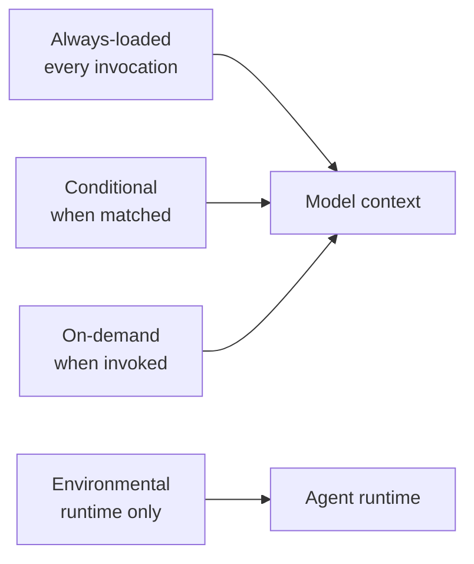

## CATES 02 - Configuration Surfaces

**Track:** CATES Learning Track
**Workspace:** [sample-repository](workspace/sample-repository/README.md)
**Associated prompt:** [14.02-cates-configuration-surfaces.prompt.md](../.github/prompts/14.02-cates-configuration-surfaces.prompt.md)

### Learning Objectives

* Identify instruction, prompt, agent, MCP, setup, hook, and editor surfaces
* Classify always-loaded, conditional, on-demand, environmental, and meta scope
* Explain why moving content changes recurring context load
* Reconcile analyzer discovery with the physical fixture tree

### Conceptual Model



### Prerequisites

* Complete Exercise 01 and preserve its baseline report
* Do not modify the sample configuration during this inventory exercise

### Inventory The Fixture

Inspect these surfaces under `workspace/sample-repository/`:

* `.github/copilot-instructions.md`
* `.github/instructions/dotnet.instructions.md`
* `.github/prompts/review-change.prompt.md`
* `.github/agents/config-reviewer.agent.md`
* `.vscode/mcp.json` and `.vscode/settings.json`
* `.github/workflows/copilot-setup-steps.yml`
* `.pre-commit-config.yaml`

Generate machine-readable discovery evidence:

```powershell
pwsh cates-exercises/scripts/Invoke-Cates.ps1 analyzer `
  cates-exercises/workspace/sample-repository `
  --format json | Set-Content `
  cates-exercises/workspace/sample-repository/reports/02-discovery.json
```

### Inspect The Results

For every discovered file, record its configuration type, active state, loading
scope, and token count. Root instructions should carry a higher recurring load
than an on-demand prompt with similar length.

### Experiment

Sketch where the inventory-specific code example in the root instructions
belongs. Do not move it yet. Compare the cost implications of a scoped
instruction, a prompt, and an ordinary reference file.

### Security, Cost, And Cleanup

Discovery does not execute configuration, nested workflows, hooks, or MCP
servers. Do not launch the intentionally weak sample MCP definitions.

### Success Criteria

* Every fixture configuration surface has a type and loading scope
* The analyzer inventory matches the files you inspected
* You can explain which content is paid on every invocation

### Key Takeaways

* Context placement is an economic design decision
* Environmental configuration can affect harness quality without adding model
  context tokens
* Narrow scope reduces recurring load only when authority remains clear

### Previous / Next

Previous: [CATES 01 - Foundations And Baseline](01-cates-foundations.md)
Next: [CATES 03 - Measurement And Token Budgets](03-cates-measurement-token-budgets.md)
