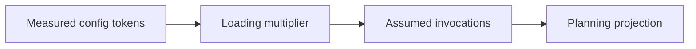

## CATES 03 - Measurement And Token Budgets

**Track:** CATES Learning Track
**Workspace:** [sample-repository](workspace/sample-repository/README.md)
**Associated prompt:** [14.03-cates-measurement-token-budgets.prompt.md](../.github/prompts/14.03-cates-measurement-token-budgets.prompt.md)

### Learning Objectives

* Record repository state, analyzer commit, tokenizer, and assumptions
* Compare model-family tokenizers without treating differences as defects
* Interpret the 1,500-token maximum for always-loaded content
* Separate static projections from measured runtime usage

### Conceptual Model



The reference planning model is:

$$
T_{monthly}=22d\left(T_aI+T_cP_cI+T_oP_oI\right)
$$

where $T_a$, $T_c$, and $T_o$ are always-loaded, conditional, and on-demand
tokens; $P_c$ and $P_o$ are activation probabilities; and $I$ is daily
invocations. This is a declared assumption model, not billing telemetry.

### Prerequisites

* Complete the surface inventory from Exercise 02
* Preserve the original sample files until the baseline JSON is captured

### Capture Reproducible Evidence

```powershell
pwsh cates-exercises/scripts/Invoke-Cates.ps1 analyzer `
  cates-exercises/workspace/sample-repository `
  --format json `
  --tokenizer openai-cl100k | Set-Content `
  cates-exercises/workspace/sample-repository/reports/03-baseline.json
```

Compare supported tokenizers:

```powershell
pwsh cates-exercises/scripts/Invoke-Cates.ps1 analyzer `
  cates-exercises/workspace/sample-repository `
  --compare-tokenizers openai-cl100k,openai-o200k,anthropic-claude
```

### Inspect The Results

Record the tokenizer, total active tokens, always-loaded tokens, score, grade,
conformance failures, and assumed daily invocations. Treat tokenizer variance
as a model-family difference and retain one canonical tokenizer for before/after
comparison.

### Experiment

Calculate a reference projection using 50 daily invocations, $P_c=0.3$, and
$P_o=0.05$. Label the result as a planning estimate. Do not translate it into
currency without a current provider-specific price and model.

### Security, Cost, And Cleanup

JSON evidence can include local paths and finding excerpts. Keep it in the
isolated reports directory and review it before sharing.

### Success Criteria

* `reports/03-baseline.json` is valid JSON
* Evidence names the tokenizer and analyzer commit
* You can distinguish measured tokens from projected invocation load
* Later comparisons will use the same tokenizer and fixture state

### Key Takeaways

* Reproducibility requires declared conditions
* Tokenizer differences are expected and must be named
* Projections support decisions but do not replace runtime telemetry

### Previous / Next

Previous: [CATES 02 - Configuration Surfaces](02-cates-configuration-surfaces.md)
Next: [CATES 04 - Token-Efficiency Remediation](04-cates-token-efficiency-remediation.md)
