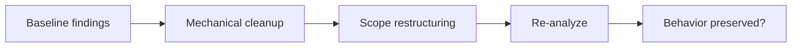

## CATES 04 - Token-Efficiency Remediation

**Track:** CATES Learning Track
**Workspace:** [sample-repository](workspace/sample-repository/README.md)
**Associated prompt:** [14.04-cates-token-efficiency-remediation.prompt.md](../.github/prompts/14.04-cates-token-efficiency-remediation.prompt.md)

### Learning Objectives

* Triage TE findings by recurring impact and remediation risk
* Remove filler, exact duplication, and unconditional verbosity
* Replace negative constraint lists with concise positive behavior
* Move context-specific examples out of always-loaded instructions
* Preserve security, testing, and project-specific value

### Conceptual Model



### Prerequisites

* Preserve `reports/03-baseline.json`
* Work only under `cates-exercises/workspace/sample-repository/`

### Triage The Findings

Use the analyzer's recommendations and rule explanations. Prioritize recurring
always-loaded waste, then cross-file duplication, then smaller local findings.

```powershell
pwsh cates-exercises/scripts/Invoke-Cates.ps1 analyzer explain TE004
pwsh cates-exercises/scripts/Invoke-Cates.ps1 analyzer explain TE006
pwsh cates-exercises/scripts/Invoke-Cates.ps1 analyzer explain TE008
```

### Remediate The Fixture

Apply the associated prompt or edit manually:

1. Remove model-default filler.
2. Keep one authoritative copy of shared .NET guidance.
3. Rewrite the negative output list as one positive, conditional output rule.
4. Move the inventory-only code example to an on-demand prompt or reference.
5. Replace the recursive `@src/**` include with specific files or a concise
   project-layout statement.
6. Remove volatile current-state instructions from always-loaded content.

### Verify The Change

```powershell
pwsh cates-exercises/scripts/Invoke-Cates.ps1 analyzer `
  cates-exercises/workspace/sample-repository `
  --format json | Set-Content `
  cates-exercises/workspace/sample-repository/reports/04-token-efficiency.json
```

Compare against Exercise 03 using the same tokenizer. A lower token count is not
successful if useful behavioral requirements disappeared.

### Experiment

Move one universally required security rule into an on-demand prompt and reason
about the failure mode, then restore it. This demonstrates why narrow loading
must not create context starvation.

### Security, Cost, And Cleanup

Security boundaries and required verification belong in durable scope even when
they add tokens. Do not optimize solely for score or file size.

### Success Criteria

* TE003, TE004, TE005, TE006, TE007, or TE008 findings improve as applicable
* Always-loaded content becomes smaller and more project-specific
* Security, scope, testing, and error behavior remain represented
* The before/after comparison uses the same tokenizer

### Key Takeaways

* Structural placement usually matters more than tiny wording reductions
* Positive instructions are more compact and actionable than prohibition lists
* Value preservation is a required optimization constraint

### Previous / Next

Previous: [CATES 03 - Measurement And Token Budgets](03-cates-measurement-token-budgets.md)
Next: [CATES 05 - Security And Least Privilege](05-cates-security-least-privilege.md)
