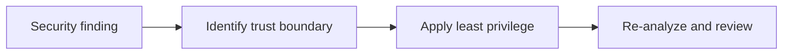

## CATES 05 - Security And Least Privilege

**Track:** CATES Learning Track
**Workspace:** [sample-repository](workspace/sample-repository/README.md)
**Associated prompt:** [14.05-cates-security-least-privilege.prompt.md](../.github/prompts/14.05-cates-security-least-privilege.prompt.md)

### Learning Objectives

* Treat critical and high security findings before efficiency work
* Restrict agent tools and approval boundaries
* Pin MCP packages and require HTTPS for remote endpoints
* Reduce setup workflow permissions and add safe validation commands
* Distinguish environment references from hardcoded values

### Conceptual Model



### Prerequisites

* Complete token-efficiency remediation without deleting security context
* Confirm the fixture contains no real credentials or identifiers

### Inspect Security Surfaces

Review the sample agent, MCP file, setup workflow, editor settings, and hook.
Explain relevant rules before editing:

```powershell
pwsh cates-exercises/scripts/Invoke-Cates.ps1 analyzer explain AGT001
pwsh cates-exercises/scripts/Invoke-Cates.ps1 analyzer explain MCP003
pwsh cates-exercises/scripts/Invoke-Cates.ps1 analyzer explain MCP006
pwsh cates-exercises/scripts/Invoke-Cates.ps1 analyzer explain EDC003
```

### Remediate The Fixture

1. Give the sample reviewer an explicit read-focused tool list and narrow file
   scope.
2. Keep approval for shell and write operations.
3. Pin the sample MCP package to an exact reviewed version.
4. Replace the remote sample endpoint with HTTPS.
5. Add concise descriptions to MCP servers.
6. Reduce the nested setup workflow to `contents: read` and add explicit test
   and lint preparation.
7. Replace the heavy pre-commit container build with a fast local check or move
   it to the nested CI example.

Use only fabricated values. Environment references such as
`{env:SAMPLE_ACCESS_VALUE}` are intentional and should remain references.

### Verify The Change

```powershell
pwsh cates-exercises/scripts/Test-CatesWorkspace.ps1 -StructureOnly
pwsh cates-exercises/scripts/Invoke-Cates.ps1 analyzer `
  cates-exercises/workspace/sample-repository `
  --format json | Set-Content `
  cates-exercises/workspace/sample-repository/reports/05-security.json
```

### Experiment

Compare a broad `Bash(*)` permission with a fixed read-only command grant.
Describe how an injected instruction changes the blast radius in each case.

### Security, Cost, And Cleanup

Never use a provider-shaped fake credential to demonstrate detection in this
repository. The track validator rejects common credential formats to avoid
secret-scanning noise and unsafe copy/paste examples.

### Success Criteria

* No critical fixture finding is introduced
* Agent and editor tool permissions are explicit and narrow
* MCP execution is pinned and remote transport uses HTTPS
* Setup and hook behavior is noninteractive, reviewable, and appropriately fast

### Key Takeaways

* Security takes precedence over token reduction
* Human approval and least privilege contain prompt-injection impact
* Environment references avoid committing secret material

### Previous / Next

Previous: [CATES 04 - Token-Efficiency Remediation](04-cates-token-efficiency-remediation.md)
Next: [CATES 06 - Configuration Quality](06-cates-quality-dimensions.md)
