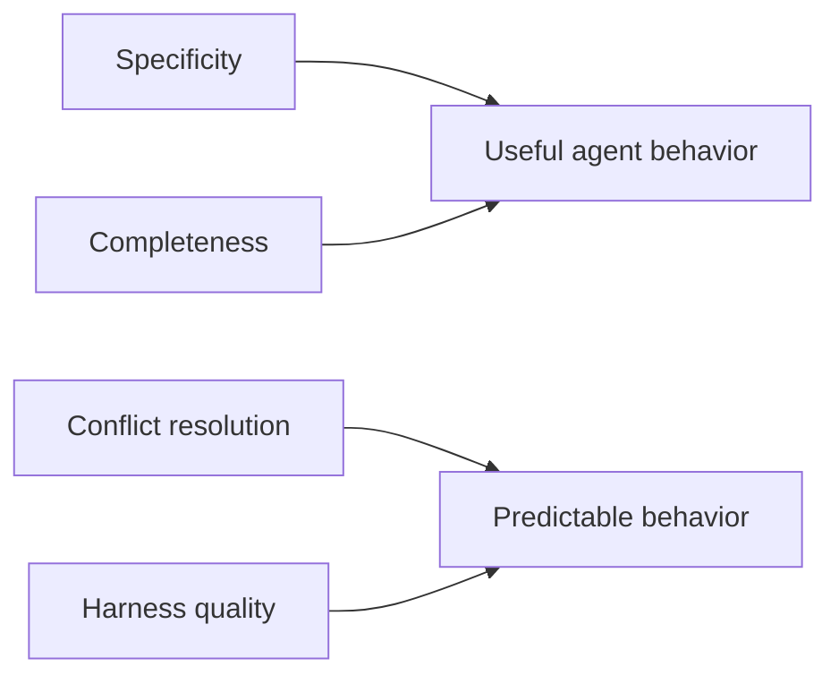

## CATES 06 - Configuration Quality

**Track:** CATES Learning Track
**Workspace:** [sample-repository](workspace/sample-repository/README.md)
**Associated prompt:** [14.06-cates-quality-dimensions.prompt.md](../.github/prompts/14.06-cates-quality-dimensions.prompt.md)

### Learning Objectives

* Replace vague guidance with concrete project anchors and decision criteria
* Cover testing, errors, architecture, security, scope, and output expectations
* Resolve contradictions according to loading scope and authority
* Add concise harness behavior for failure escalation and self-verification

### Conceptual Model



### Prerequisites

* Complete the token-efficiency and security passes
* Keep shared authority in one location rather than copying fixes across files

### Inspect The Quality Findings

```powershell
pwsh cates-exercises/scripts/Invoke-Cates.ps1 analyzer explain SPC001
pwsh cates-exercises/scripts/Invoke-Cates.ps1 analyzer explain CMP002
pwsh cates-exercises/scripts/Invoke-Cates.ps1 analyzer explain CNF001
pwsh cates-exercises/scripts/Invoke-Cates.ps1 analyzer explain CNF002
```

### Remediate The Fixture

1. Name the .NET version and the inventory source path.
2. Define input validation and exception behavior for `InventoryService`.
3. State the narrow command or check used to validate changes.
4. Describe source, test, and configuration boundaries in a compact layout.
5. Add an output contract that defaults to a concise summary and validation
   evidence.
6. Add failure behavior: stop on unresolved validation errors and report the
   exact failing command.
7. Resolve any remaining concise-versus-verbose or broad-versus-narrow scope
   contradictions.

### Verify The Change

```powershell
pwsh cates-exercises/scripts/Invoke-Cates.ps1 analyzer `
  cates-exercises/workspace/sample-repository `
  --format json | Set-Content `
  cates-exercises/workspace/sample-repository/reports/06-quality.json
```

Review findings by dimension instead of chasing only the overall number.

### Experiment

Write one vague rule and one anchored replacement. Compare their token counts
and actionability. The better rule may be slightly longer while delivering more
behavioral value.

### Security, Cost, And Cleanup

Do not resolve completeness by creating a large generic checklist. Add only the
project-specific facts needed for safe and repeatable work.

### Success Criteria

* Project technology, layout, validation, and error behavior are concrete
* Required harness elements are present and concise
* Contradictory loaded instructions are resolved
* Quality improves without restoring cross-file duplication

### Key Takeaways

* Specificity measures behavioral leverage, not word count
* Completeness should be concise and project-specific
* A useful harness defines scope, failure behavior, output, and verification

### Previous / Next

Previous: [CATES 05 - Security And Least Privilege](05-cates-security-least-privilege.md)
Next: [CATES 07 - Policy And Suppressions](07-cates-policy-and-suppressions.md)
