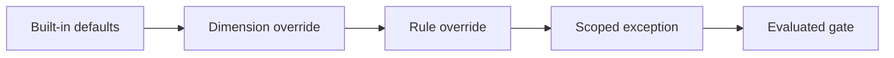

## CATES 07 - Policy And Suppressions

**Track:** CATES Learning Track
**Workspace:** [sample-repository](workspace/sample-repository/README.md)
**Associated prompt:** [14.07-cates-policy-and-suppressions.prompt.md](../.github/prompts/14.07-cates-policy-and-suppressions.prompt.md)

### Learning Objectives

* Define score, conformance, severity, and always-loaded-token gates
* Explain rule-over-dimension-over-default precedence
* Document a temporary exception with owner, rationale, expiry, and control
* Prevent suppressions from manufacturing a conformance claim

### Conceptual Model



### Prerequisites

* Complete stable remediation through Exercise 06
* Review unresolved findings and identify their owners

### Create The Sandbox Policy

Create `cates-exercises/workspace/sample-repository/.cates.yml`. Do not create a
policy at the calculator repository root. Begin with:

```yaml
minScore: 70
requireLevel: 2
failOn:
  - critical
  - high
maxAlwaysLoadedTokens: 1500
assumedDailyInvocations: 50
rules:
  TE004: high
suppressions: []
```

If a genuine low-confidence false positive remains, add one narrowly scoped
suppression with a rule ID, file, reason, owner, expiry, and compensating
control. Do not suppress hardcoded secrets, injection, unsafe execution, or
approval bypass findings.

### Evaluate The Policy

```powershell
pwsh cates-exercises/scripts/Invoke-Cates.ps1 analyzer `
  cates-exercises/workspace/sample-repository `
  --policy cates-exercises/workspace/sample-repository/.cates.yml
```

Exit code `0` means analysis and configured gates pass. Exit code `1` means a
gate failed. Exit code `2` indicates invalid input or policy syntax.

### Inspect The Results

Confirm disabled rules, dimensions, and suppressed findings remain auditable in
JSON output. A suppression does not erase accountability or make an unsafe
configuration safe.

### Experiment

Temporarily lower one rule severity and compare the result with disabling the
whole dimension. Restore the stricter policy and explain why the narrower
override preserves more signal.

### Security, Cost, And Cleanup

Security findings must not be traded away to meet an efficiency target. Review
exceptions before expiry and remove them when the underlying condition changes.

### Success Criteria

* The policy exists only inside the nested sample repository
* Policy syntax is valid and exit codes are understood
* Every exception is scoped, owned, reasoned, time-bound, and compensated
* Critical security rules remain enabled

### Key Takeaways

* Policy turns analysis into a reviewed repository contract
* Narrow overrides preserve signal better than broad dimension disabling
* Conformance claims require evidence, not score manipulation

### Previous / Next

Previous: [CATES 06 - Configuration Quality](06-cates-quality-dimensions.md)
Next: [CATES 08 - Lossless Optimization](08-cates-lossless-optimization.md)
