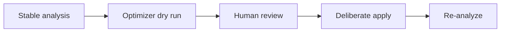

## CATES 08 - Lossless Optimization

**Track:** CATES Learning Track
**Workspace:** [sample-repository](workspace/sample-repository/README.md)
**Associated prompt:** [14.08-cates-lossless-optimization.prompt.md](../.github/prompts/14.08-cates-lossless-optimization.prompt.md)

### Learning Objectives

* Run optimizer dry-run before any write
* Understand the meaningful-instruction and code-block preservation guarantees
* Apply exact duplicate, filler, and whitespace transformations deliberately
* Separate mechanical cleanup from security and structural judgment

### Conceptual Model



### Prerequisites

* Preserve reports from Exercises 03 through 07
* Ensure `git diff` or a file comparison can show optimizer changes

### Preview Lossless Changes

```powershell
pwsh cates-exercises/scripts/Invoke-Cates.ps1 optimizer `
  cates-exercises/workspace/sample-repository `
  --dry-run | Tee-Object `
  cates-exercises/workspace/sample-repository/reports/08-optimizer-dry-run.md
```

Review every proposed file and transformation. The optimizer should leave
security remediation, cross-file restructuring, forced-verbosity rewriting,
and scope decisions as manual opportunities.

### Apply Deliberately

```powershell
pwsh cates-exercises/scripts/Invoke-Cates.ps1 optimizer `
  cates-exercises/workspace/sample-repository `
  --backup
```

The `--backup` option creates `.orig` files inside the isolated workspace. Do
not copy backups into the immutable template.

### Verify The Result

```powershell
pwsh cates-exercises/scripts/Invoke-Cates.ps1 analyzer `
  cates-exercises/workspace/sample-repository `
  --format json | Set-Content `
  cates-exercises/workspace/sample-repository/reports/08-after-optimizer.json
```

Confirm meaningful instructions and code blocks remain represented. Compare
token and finding changes with the pre-optimizer report.

### Experiment

Run a second dry run. It should report no repeatable mechanical gains for work
already applied. This demonstrates idempotent optimization behavior.

### Security, Cost, And Cleanup

Do not treat an optimizer guarantee as approval for semantic rewriting. Review
manual recommendations separately and retain useful context even when it costs
tokens.

### Success Criteria

* Dry-run evidence exists before applied changes
* Applied changes match the reviewed mechanical scope
* Meaningful instruction and code-block content remains
* Re-analysis documents the exact before/after effect

### Key Takeaways

* Previewability and reversibility are required automation controls
* Lossless cleanup has a narrower boundary than full remediation
* Re-analysis verifies the result with the same measurement engine

### Previous / Next

Previous: [CATES 07 - Policy And Suppressions](07-cates-policy-and-suppressions.md)
Next: [CATES 09 - CI And SARIF](09-cates-ci-and-sarif.md)
