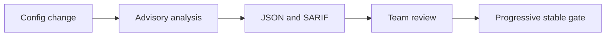

## CATES 09 - CI And SARIF

**Track:** CATES Learning Track
**Workspace:** [sample-repository](workspace/sample-repository/README.md)
**Associated prompt:** [14.09-cates-ci-and-sarif.prompt.md](../.github/prompts/14.09-cates-ci-and-sarif.prompt.md)

### Learning Objectives

* Scope CI triggers to coding-agent configuration changes
* Build the verified CATES source commit reproducibly on a runner
* Publish JSON and SARIF evidence with minimum permissions
* Move from advisory reporting to deliberate stable gates

### Conceptual Model



### Isolation Boundary

Create the workflow only at
`cates-exercises/workspace/sample-repository/.github/workflows/cates-analysis.yml`.
GitHub does not discover workflows nested under `cates-exercises/` in the outer
repository. Do not copy this file to the calculator's active workflow folder.

### Design The Workflow

Use the associated prompt to create an educational sample that:

1. Runs for pull requests changing recognized coding-agent configuration.
2. grants `contents: read`; add `security-events: write` only for SARIF upload.
3. checks out the sample repository in a standalone use case.
4. checks out Microsoft CATES at commit
   `e49da25b0bd94068419bda2a0c73fbb42c527e7e` into a tool directory.
5. runs `npm ci` and `npm run build` in that tool checkout.
6. generates JSON and SARIF with `node dist/cli/index.js`.
7. uploads evidence with bounded retention.
8. begins advisory, then demonstrates a separate Level 2 gate.

### Validate The Sample

Inspect YAML diagnostics and run `actionlint` when available:

```powershell
$actionlint = Get-Command actionlint -ErrorAction SilentlyContinue
if ($actionlint) {
  actionlint `
    cates-exercises/workspace/sample-repository/.github/workflows/cates-analysis.yml
}
```

### Inspect The Results

Review permissions, trigger paths, version pins, artifact retention, failure
behavior, and the boundary between advisory findings and blocking gates. Verify
experimental findings are never used for gating.

### Experiment

Design a rollout with three stages: report only, block critical/high findings,
then require Level 2. Name the evidence and review criteria needed before each
stage advances.

### Security, Cost, And Cleanup

SARIF upload permissions are unnecessary when evidence remains an artifact.
Grant them only for a real code-scanning integration. CI runner minutes and
artifact retention have cost, so path filters and retention limits matter.

### Success Criteria

* The sample workflow exists only in the isolated nested repository
* Source and actions are pinned or version-controlled deliberately
* Permissions and triggers are narrowly scoped
* Stable gates are separate from experimental advisory output

### Key Takeaways

* Start with evidence before enforcing a new quality gate
* CI should measure only relevant changes and expose actionable output
* Experimental CATES rules must never silently affect conformance gates

### Previous / Next

Previous: [CATES 08 - Lossless Optimization](08-cates-lossless-optimization.md)
Next: [CATES 10 - Governance Capstone](10-cates-governance-capstone.md)
