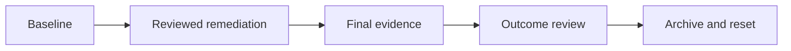

## CATES 10 - Governance Capstone

**Track:** CATES Learning Track
**Workspace:** [sample-repository](workspace/sample-repository/README.md)
**Associated prompt:** [14.10-cates-governance-capstone.prompt.md](../.github/prompts/14.10-cates-governance-capstone.prompt.md)

### Learning Objectives

* Produce a defensible conformance assessment with versioned evidence
* Compare baseline and final outcomes without score gaming
* Prove experimental findings do not affect stable score or gates
* Archive a completed run before restoring the starter workspace

### Conceptual Model



### Produce Final Stable Evidence

```powershell
pwsh cates-exercises/scripts/Invoke-Cates.ps1 analyzer `
  cates-exercises/workspace/sample-repository `
  --format json `
  --tokenizer openai-cl100k | Set-Content `
  cates-exercises/workspace/sample-repository/reports/10-final-stable.json
```

Record the standard version, analyzer commit, assessment date, tokenizer,
repository state, score, level, unresolved findings, and policy. A public claim
must name the CATES version and conformance level and must satisfy all level
requirements, not only the score threshold.

### Verify Experimental Isolation

```powershell
pwsh cates-exercises/scripts/Invoke-Cates.ps1 analyzer `
  cates-exercises/workspace/sample-repository `
  --format json `
  --experimental | Set-Content `
  cates-exercises/workspace/sample-repository/reports/10-experimental.json
```

Compare stable score, grade, findings, and conformance between the two reports.
Ignore timestamps and the separate `experimental` object. Stable results must
remain unchanged.

### Review Governance Outcomes

Evaluate these questions before claiming success:

* Did task guidance remain useful and project-specific?
* Did security controls remain stronger than efficiency pressure?
* Are suppressions owned, expiring, and compensated?
* Would developers complete representative tasks with less rework?
* Does CI adoption progress from evidence to proportionate enforcement?

### Validate And Preview Reset

```powershell
pwsh cates-exercises/scripts/Test-CatesWorkspace.ps1 -StructureOnly
pwsh cates-exercises/scripts/Reset-CatesWorkspace.ps1 -WhatIf
```

Review the exact archive destination. Then archive and recreate the workspace:

```powershell
pwsh cates-exercises/scripts/Reset-CatesWorkspace.ps1 -Confirm
```

### Inspect The Results

Confirm a new `completed/run-*` directory contains the final reports and edited
sample repository. Confirm `workspace/` contains a clean copy of the immutable
starter and no prior final report.

### Security, Cost, And Cleanup

Reset affects only the CATES track. It does not delete prior archives, change
the calculator, remove the tool cache, stage files, commit, or push. Review
completed snapshots before sharing because reports may contain local paths.

### Success Criteria

* Final evidence supports or rejects a conformance claim explicitly
* Experimental analysis leaves stable results and gates unchanged
* Governance review considers security, usefulness, and task outcomes
* The completed run is archived before a clean workspace is restored

### Key Takeaways

* Conformance is a versioned evidence claim, not a badge based on score alone
* Experimental findings are advisory and isolated by design
* Repeatable practice requires preservation before reset

### Previous / Finish

Previous: [CATES 09 - CI And SARIF](09-cates-ci-and-sarif.md)
Finish: Return to the [CATES learning track catalog](README.md#exercise-catalog).
