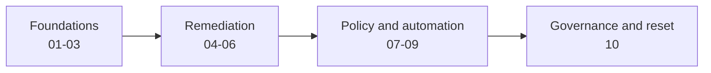

## How The Track Works

This track teaches the [Coding Agent Token Economics Standard](https://github.com/microsoft/cates)
through ten exercises modeled on the repository's GitHub Actions curriculum.
All analysis and remediation occurs in `cates-exercises/workspace/`; the
calculator, main labs, and active repository configuration remain unchanged.



The CATES standard document and analyzer are versioned independently. These
lessons target standard `1.0.0-draft` and the reference implementation at
verified commit `e49da25b0bd94068419bda2a0c73fbb42c527e7e`. The source tree at
that commit reports package metadata `1.2.0` and includes unreleased optimizer
and experimental capabilities. Record both the standard version and commit in
assessment evidence.

## Isolation Model

| Path | Purpose |
| --- | --- |
| `assets/workspace-template/` | Immutable reset source |
| `workspace/sample-repository/` | Only location learners analyze and modify |
| `completed/run-*/` | Timestamped archives of finished attempts |
| `tools/cates/` | Ignored, commit-pinned reference implementation checkout |
| `scripts/` | Setup, invocation, validation, and reset automation |

The nested sample repository contains intentionally inefficient and unsafe
coding-agent configuration. Its values are fabricated, and its nested workflow
files cannot execute as workflows in the outer calculator repository.

## Prerequisites

* PowerShell 7, Git, Node.js 20 or later, and npm
* Network access to GitHub and the npm registry during the first tool build
* A learner branch or fork when you want to preserve completed snapshots
* GitHub Copilot for the reusable prompts, or manual editing for each exercise

Initialize the track from the calculator repository root:

```powershell
pwsh cates-exercises/scripts/Install-CatesTool.ps1
pwsh cates-exercises/scripts/Initialize-CatesWorkspace.ps1
pwsh cates-exercises/scripts/Test-CatesWorkspace.ps1
```

If package restore is blocked by a network proxy, run structure-only validation
and resolve the feed before Exercise 01:

```powershell
pwsh cates-exercises/scripts/Test-CatesWorkspace.ps1 -StructureOnly
```

## Exercise Catalog

| Index | Lesson | Concept | Primary Artifact |
| --- | --- | --- | --- |
| 01 | [Foundations And Baseline](01-cates-foundations.md) | Standard scope, versions, first report | Baseline pretty report |
| 02 | [Configuration Surfaces](02-cates-configuration-surfaces.md) | Discovery and loading scopes | Surface inventory |
| 03 | [Measurement And Budgets](03-cates-measurement-token-budgets.md) | Tokenizers, assumptions, JSON evidence | Baseline JSON report |
| 04 | [Token-Efficiency Remediation](04-cates-token-efficiency-remediation.md) | TE findings and context placement | Refactored instructions |
| 05 | [Security And Least Privilege](05-cates-security-least-privilege.md) | SEC, MCP, setup, agent, and editor risk | Security remediation |
| 06 | [Configuration Quality](06-cates-quality-dimensions.md) | Specificity, completeness, conflicts, harness | Quality remediation |
| 07 | [Policy And Suppressions](07-cates-policy-and-suppressions.md) | Gates, overrides, governed exceptions | Sample `.cates.yml` |
| 08 | [Lossless Optimization](08-cates-lossless-optimization.md) | Dry run, optimizer guarantees, manual boundary | Optimization report |
| 09 | [CI And SARIF](09-cates-ci-and-sarif.md) | Advisory reporting and progressive gates | Nested sample workflow |
| 10 | [Governance Capstone](10-cates-governance-capstone.md) | Conformance claims, experimental isolation, reset | Final evidence and archive |

## Safety And Lifecycle

* Never add real credentials, identifiers, personal data, or production URLs to
  the fixture
* Never copy the nested sample workflow into the outer `.github/workflows/`
  directory as part of these exercises
* Preview resets before confirming them
* Treat scores as decision support, not as a reason to remove useful security,
  correctness, or testing guidance
* Keep experimental cache/output findings advisory; they do not affect stable
  score, conformance, or CI gates

At the end of Exercise 10, preview and run the track-local reset:

```powershell
pwsh cates-exercises/scripts/Reset-CatesWorkspace.ps1 -WhatIf
pwsh cates-exercises/scripts/Reset-CatesWorkspace.ps1 -Confirm
```

The reset archives the current workspace before restoring the immutable starter.
It does not delete older runs, stage files, commit, push, or change another
repository path.
