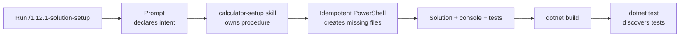

## Exercise 01.01 - Solution Setup

**Module:** 01 - Build The Calculator Solution
**Associated prompt:** [1.12.1-solution-setup.prompt.md](../.github/prompts/1.12.1-solution-setup.prompt.md)

### Learning Objectives

* Scaffold a .NET solution with a console project and an xUnit test project.
* Practice launching a staged, reusable Copilot prompt from Copilot Chat.
* Understand how a prompt file can delegate its procedure to a Copilot skill
  (`calculator-setup`) with scripts and templates.
* Validate a freshly created solution with `dotnet build` and `dotnet test`.

### Overview Of The Prompt

The `1.12.1` prompt is a thin launcher that invokes the `calculator-setup`
skill. The skill runs an idempotent PowerShell setup script that creates the
solution file, the `calculator` console project, and the `calculator.tests`
xUnit project under `src/workspace/calculator-xunit-testing/`, then verifies
the result with a build and test discovery run.



The prompt is the entry point, the skill is the reusable procedure, and the
script makes repeated setup runs predictable.

### Steps

1. Confirm the prerequisites in the [README](../README.md), including hiding
   the `src/completed/` folder so the finished solution cannot leak into
   Copilot suggestions.
2. In Copilot Chat, run `/1.12.1-solution-setup`.
3. Review the files created under `src/workspace/calculator-xunit-testing/`.
4. Validate the result:

   ```bash
   dotnet build src/workspace/calculator-xunit-testing/calculator.slnx
   dotnet test src/workspace/calculator-xunit-testing/calculator.slnx --no-build
   ```

### Success Criteria

* The solution, console project, and test project exist and build cleanly.
* Test discovery succeeds, even if only starter tests exist at this stage.

### Next Exercise

Continue with [Exercise 01.02 - Calculator Implementation](01.02-calculator-implementation.md).
