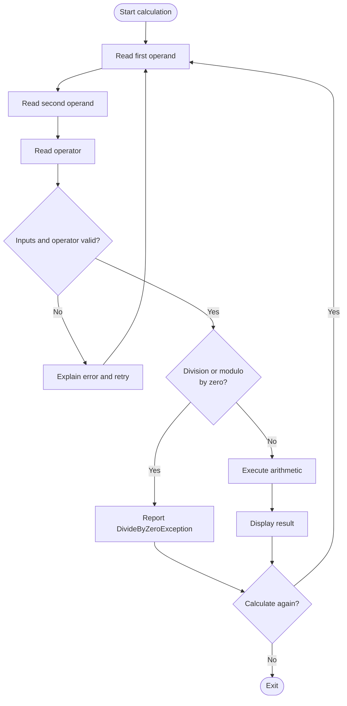

## Exercise 01.02 - Calculator Implementation

**Module:** 01 - Build The Calculator Solution
**Associated prompt:** [1.12.2-calculator-implementation.prompt.md](../.github/prompts/1.12.2-calculator-implementation.prompt.md)

### Learning Objectives

* Implement arithmetic operations: add, subtract, multiply, divide, modulo,
  and exponent.
* Build an interactive console loop that reads operands and an operator.
* Handle invalid input and divide-by-zero conditions without crashing.
* Practice iterating on Copilot-generated code with focused follow-up prompts.

### Overview Of The Prompt

The `1.12.2` prompt directs Copilot to implement the calculator behavior
defined in the [calculator PRD](../docs/prd-csharp-basic-calculator-solution.md).
It produces the console workflow in `Calculator.cs` and the pure arithmetic
methods that the tests exercise, including `DivideByZeroException` handling for
division and modulo.



The loop separates recoverable input errors from valid calculations and gives
the learner an explicit place to reason about exceptional arithmetic.

### Steps

1. Complete [Exercise 01.01](01.01-solution-setup.md) first.
2. In Copilot Chat, run the `1.12.2` prompt and review the proposed changes.
3. Run the console app and exercise each operator, including error cases:

   ```bash
   dotnet run --project src/workspace/calculator-xunit-testing/calculator/calculator.csproj
   ```

4. Try non-numeric operands, unsupported operators, and division by zero.

### Success Criteria

* All six operators return correct results from the console app.
* Invalid input produces a clear message and re-prompts instead of crashing.
* The app asks whether to perform another calculation before exiting.

### Next Exercise

Continue with [Exercise 01.03 - Refactoring Steps](01.03-refactoring-steps.md).
