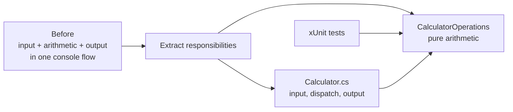

## Exercise 01.03 - Refactoring Steps

**Module:** 01 - Build The Calculator Solution
**Associated prompt:** [1.12.3-refactor-steps.prompt.md](../.github/prompts/1.12.3-refactor-steps.prompt.md)

### Learning Objectives

* Separate pure arithmetic logic from console input and output concerns.
* Extract focused helper methods such as operand reading, operator reading,
  and continue-or-exit handling.
* Apply single-responsibility and testability principles during refactoring.
* Verify behavior is preserved after each refactoring step.

### Overview Of The Prompt

The `1.12.3` prompt guides Copilot through incremental refactoring of the
working calculator. The outcome is a `CalculatorOperations` class containing
pure, documented arithmetic methods and a lean console loop that delegates to
it. This structure is what makes the later testing exercises straightforward.



The behavior stays the same, but dependency direction becomes clear: both the
console and tests depend on pure operations; arithmetic does not depend on UI.

### Steps

1. Complete [Exercise 01.02](01.02-calculator-implementation.md) first.
2. In Copilot Chat, run `/1.12.3-refactor-steps`.
3. Review each refactoring in the diff before accepting it.
4. Rebuild and rerun the console app to confirm identical behavior:

   ```bash
   dotnet build src/workspace/calculator-xunit-testing/calculator.slnx
   dotnet run --project src/workspace/calculator-xunit-testing/calculator/calculator.csproj
   ```

### Success Criteria

* Arithmetic logic lives in pure static methods with XML documentation.
* The console loop only orchestrates input, dispatch, and output.
* Manual smoke testing shows no behavior change from Exercise 01.02.

### Next Exercise

Continue with [Exercise 01.04 - Testing Strategy](01.04-testing-strategy.md).
