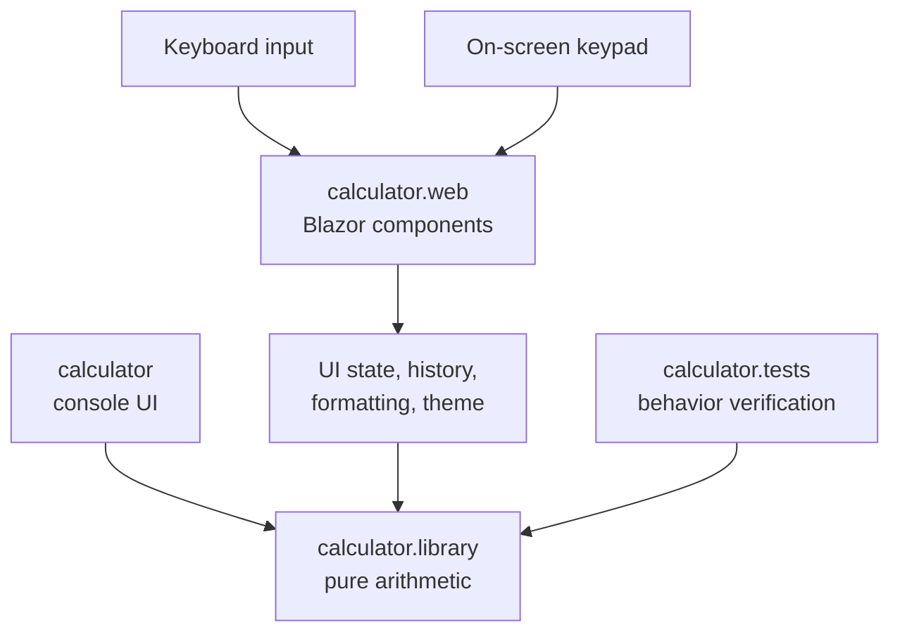

## Exercise 02.02 - Refactor To A Blazor Web App

**Module:** 02 - Modernize And Migrate
**Associated prompt:** [3.01.1-refactor-calculator-blazor-app.prompt.md](../.github/prompts/3.01.1-refactor-calculator-blazor-app.prompt.md)

### Learning Objectives

* Extract shared calculator logic into a reusable class library.
* Add a Blazor web front end with an interactive keypad, keyboard input,
  calculation history, and theme support.
* Preserve the existing xUnit test suite while restructuring projects.
* Practice larger, multi-project refactoring with Copilot and the
  `refactor-calculator-blazor-app` skill.

### Overview Of The Prompt

The `3.01.1` prompt refactors the post-upgrade workspace into a Blazor web
app. It moves pure arithmetic into a shared `calculator.library` project,
adds a `calculator.web` Blazor project with UI components and services, keeps
the console app working, and ensures tests still pass against the shared
library.



The shared library is the stable center. Multiple interfaces can use it, while
UI state remains in the web project and tests target deterministic behavior.

### Steps

1. Complete [Exercise 02.01](02.01-upgrade-dotnet-8-to-10.md) first.
2. In Copilot Chat, run the `3.01.1` Blazor refactoring prompt.
3. Review the new project structure and component files.
4. Run the web app and the test suite:

   ```bash
   dotnet run --project src/workspace/calculator-xunit-testing/calculator.web/calculator.web.csproj
   dotnet test src/workspace/calculator-xunit-testing/calculator.slnx
   ```

### Success Criteria

* The Blazor app performs all calculator operations from the browser.
* Keyboard input and calculation history work.
* The full test suite still passes after the refactoring.

### Next Exercise

Continue with [Exercise 02.03 - Azure Migration Assessment](02.03-azure-migration-assessment.md).
