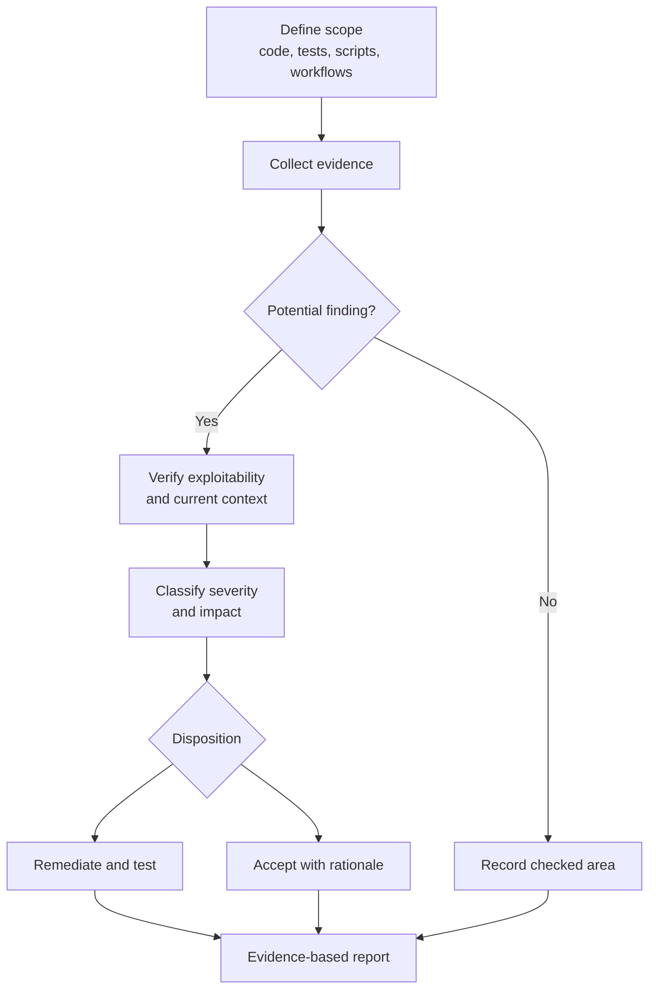

## Exercise 03.01 - Security Assessment

**Module:** 03 - Quality, Security, And Wrap-Up
**Associated prompt:** [7.01-conduct-security-assessment.prompt.md](../.github/prompts/7.01-conduct-security-assessment.prompt.md)

### Learning Objectives

* Perform a structured security review of application code, tests, scripts,
  and workflows.
* Check for hardcoded secrets, unvalidated input, and unsafe error handling.
* Map findings to severity levels and produce actionable remediation steps.
* Practice using Copilot as a security review assistant rather than an
  auto-fixer.

### Overview Of The Prompt

The `7.01` prompt conducts a comprehensive security assessment of the
calculator application and its associated components. It reviews source code,
test data handling, PowerShell scripts, and GitHub Actions workflows, and
produces a findings report. The prompt text predates the .NET 10 upgrade, so
treat any .NET 8 references as legacy context and assess the current
workspace.

Copilot proposes findings; evidence and human judgment determine whether they
are real, how severe they are, and what action is proportionate.

### Steps

1. Complete through [Exercise 01.04](01.04-testing-strategy.md) so there is
  real, tested code to assess.
2. In Copilot Chat, run `/7.01-conduct-security-assessment`.
3. Review the findings report and challenge anything that looks like a false
   positive.
4. Remediate agreed findings in small, reviewable commits.

### Success Criteria

* A findings report exists with severity ratings and remediation guidance.
* No hardcoded credentials exist in code, prompts, scripts, or test data.
* Input validation and error handling findings are resolved or accepted with
  rationale.

### Next Exercise

Continue with [Exercise 03.02 - Comprehensive Quality Gate](03.02-comprehensive-quality-gate.md).
