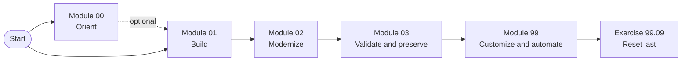
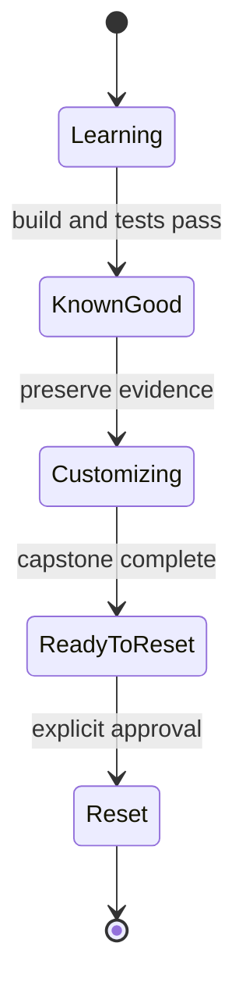

## How The Exercises Are Organized

The exercises remain in one flat directory so their paths stay short and stable.
Modules are logical curriculum groups, not subdirectories. Each filename uses a
`module.exercise` identifier: for example, `02.03` means Module 02, Exercise
03.

The root [Lab Exercises catalog](../README.md#lab-exercises) lists every
exercise and its associated prompt. Use this page to understand the groups and
their recommended sequence.

Read the map from left to right. Solid arrows show the required learning path;
the dotted arrow marks Module 00 as useful orientation rather than a prerequisite.

## Module Sequence

| Module | Name | Purpose |
| ------ | ---- | ------- |
| 00 | Explore The Copilot Workspace | Optional orientation to repository Copilot configuration |
| 01 | Build The Calculator Solution | Create, implement, refactor, and test the calculator baseline |
| 02 | Modernize And Migrate | Upgrade the solution, add the Blazor app, and assess Azure readiness |
| 03 | Quality, Security, And Wrap-Up | Assess security and quality, then preserve the completed workspace |
| 99 | Finished Project Customization | Practice advanced customization, complete the capstone, and reset last |

Module 00 is optional. Complete Modules 01 through 03 in order before starting
Module 99. Within each module, follow the exercise numbers unless an exercise
explicitly identifies itself as optional. Exercise 99.09 is the final cleanup
step and must remain last.

The state model explains why cleanup is last: each transition depends on
evidence or artifacts produced by the state before it.

## Navigation Rules

* Module labels provide curriculum context.
* Prerequisites and next steps link to specific exercises so the required work
  is unambiguous.
* Existing exercise filenames and paths remain stable even though the files are
  grouped conceptually.
* The `Module` line near the top of each exercise uses the canonical names in
  the table above.
