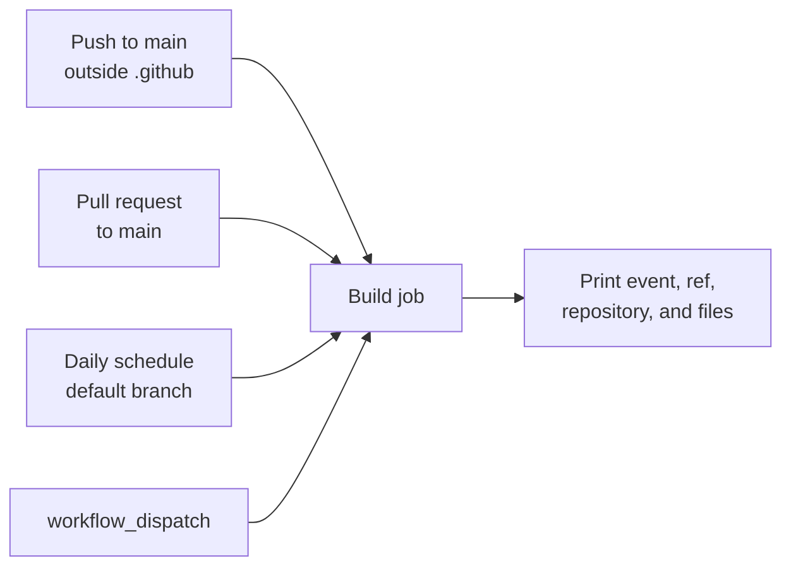

## Workflow 01 - Basic Triggers

**Track:** GitHub Actions Workflow Labs
**Workflow:** [01-basic-triggers-workflow.yml](../.github/workflows/01-basic-triggers-workflow.yml)
**Associated prompt:** [13.01-create-01-basic-triggers-workflow.prompt.md](../.github/prompts/13.01-create-01-basic-triggers-workflow.prompt.md)

### Learning Objectives

* Distinguish push, pull request, schedule, and manual triggers.
* Explain branch and path filters.
* Read event, ref, and repository context from logs.

### Conceptual Model

Four event sources converge on one job. Filters determine whether a matching
event creates a run before any runner starts.

### Prerequisites

* Fork the repository and enable GitHub Actions in the fork.
* Keep `main` as the default branch while completing this exercise.

### Workflow Walkthrough

The `on` block listens for pushes to `main`, pull requests targeting `main`, a
daily midnight UTC schedule, and manual dispatch. Pushes that change only
`.github/**` are ignored. The `Build` job prints event context, checks out the
repository, and lists repository and `src` contents.

### Run The Workflow

1. Open **Actions** in your fork.
2. Select **01-basic-triggers-workflow**.
3. Select **Run workflow**, choose `main`, and start the run.

### Inspect The Results

Confirm that the run reports `workflow_dispatch`, the selected ref, your fork's
repository name, and checked-out file listings.

### Experiment

Create a short-lived branch and pull request targeting `main`. Compare its
`pull_request` context with the manual run. Avoid waiting for the schedule as
the primary validation because GitHub schedules can be delayed.

### Security, Cost, And Cleanup

This workflow declares no explicit token permissions, so repository defaults
apply. A later lesson improves that boundary. Scheduled runs consume runner
minutes even when no learner is present. Close the practice pull request and
delete its branch after comparison.

### Success Criteria

* A manual run succeeds in the learner fork.
* You can explain when the push and pull request filters match.
* You can identify the event name and ref in the logs.

### Key Takeaways

* Triggers decide when a workflow is eligible to run.
* Branch and path filters reduce unnecessary runs.
* Event context changes with the trigger source.

### Next Exercise

Continue with [Workflow 02 - Script Runners](02-list-dir-with-python-workflow.md).
