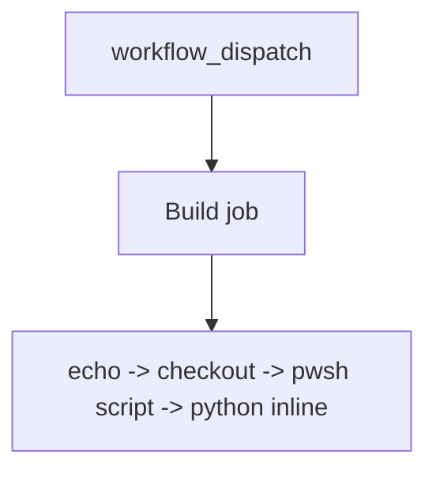

## Workflow 02 - Script runners

**Track:** Foundations

**Workflow:** [02-list-dir-with-python-workflow.yml](../.github/workflows/02-list-dir-with-python-workflow.yml)

**Associated prompt:** [13.02-create-02-script-runners-workflow.prompt.md](../.github/prompts/13.02-create-02-script-runners-workflow.prompt.md)

### Learning Objectives

* Run repository-root scripts from workflow steps.
* Use inline Python for quick tasks.
* Compare shell, PowerShell script, and Python invocation patterns.

### Conceptual Model

The job executes a mix of inline shell, a checked-in PowerShell script at `scripts/Get-DirectoryContents.ps1`, and an inline Python block to demonstrate runner capabilities.

### Prerequisites

* Fork the repository.
* Ensure `scripts/Get-DirectoryContents.ps1` and `scripts/getDirectoryContents.py` exist in the fork (they are present in this repo).

### Workflow Walkthrough

* Trigger: `workflow_dispatch` only.
* Steps include printing contexts, `actions/checkout@v4`, running `./scripts/Get-DirectoryContents.ps1` with `pwsh`, and an inline Python heredoc listing `./src`.

### Run The Workflow

From your fork Actions UI, choose `02-list-dir-with-python-workflow` and click "Run workflow".

### Inspect The Results

* `list-contents-with-powershell` executes the checked-in script; logs show its output.
* `list-contents-with-python` prints file paths discovered under `./src`.

### Experiment

* Replace the inline Python with a different script or extend the PowerShell helper to collect additional metadata.

### Security, Cost, And Cleanup

* No secrets, no billable resources.

### Success Criteria

* The PowerShell script ran and printed repo contents.
* The inline Python step listed `./src` entries.

### Key Takeaways

* Runners offer multiple scripting options; choose what's available and familiar for the task.

### Previous / Next

* Previous: [01-basic-triggers-workflow.md](01-basic-triggers-workflow.md)
* Next: [03-multiple-jobs-workflow.md](03-multiple-jobs-workflow.md)
