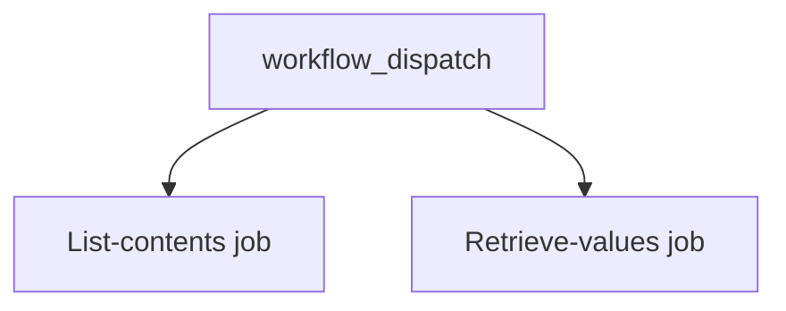

## Workflow 03 - Multiple jobs

**Track:** Foundations

**Workflow:** [03-multiple-jobs-workflow.yml](../.github/workflows/03-multiple-jobs-workflow.yml)

**Associated prompt:** [13.03-create-03-multiple-jobs-workflow.prompt.md](../.github/prompts/13.03-create-03-multiple-jobs-workflow.prompt.md)

### Learning Objectives

* Learn that jobs run in parallel by default.
* Use multiple scripts and inline steps across jobs.

### Conceptual Model

By default jobs `list-contents` and `retrieve-values` run in parallel. Use `needs:` to express dependencies when required.

### Prerequisites

* Fork the repo. No secrets required.

### Workflow Walkthrough

* `list-contents` runs checkout, PowerShell scripts, inline PowerShell, and Python helper scripts.
* `retrieve-values` prints the current ref using `${{ github.ref }}`.

### Run The Workflow

Run `03-multiple-jobs-workflow` from your fork's Actions UI using manual dispatch.

### Inspect The Results

* The Actions run shows two concurrent jobs in the UI.
* Logs from each job appear independently; `list-contents` logs include the outputs of the helper scripts.

### Experiment

* Add `needs: list-contents` to `retrieve-values` in a fork to see sequential execution.

### Security, Cost, And Cleanup

* Low risk. No cloud costs.

### Success Criteria

* Two jobs appear and complete (or run concurrently) when dispatched.

### Key Takeaways

* Use `needs` to serialize jobs when data or artifacts must flow between them.

### Previous / Next

* Previous: [02-list-dir-with-python-workflow.md](02-list-dir-with-python-workflow.md)
* Next: [04-environments-workflow.md](04-environments-workflow.md)
