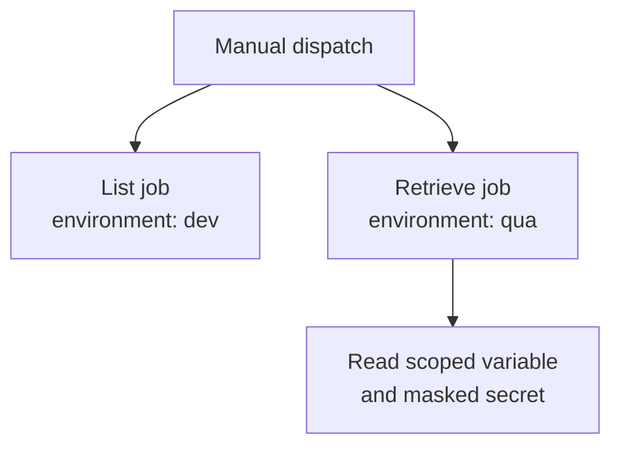

## Workflow 04 - Environments

**Track:** Configuration

**Workflow:** [04-environments-workflow.yml](../.github/workflows/04-environments-workflow.yml)

**Associated prompt:** [13.04-create-04-environments-workflow.prompt.md](../.github/prompts/13.04-create-04-environments-workflow.prompt.md)

### Learning Objectives

* Understand environment-bound jobs and how `environment:` enforces protection rules.
* Map variables and secrets from repository `vars` and `secrets` into job environments.

### Conceptual Model

The two jobs are independent and target different GitHub environments.
Environment protection rules such as required reviewers or wait timers may
block either job until its own rules are satisfied.

### Prerequisites

* Fork repo. If you want to experiment with protected environments, create equivalent `dev` and `qua` environments in your fork and configure protection rules.

### Workflow Walkthrough

* `list-contents` uses `environment: dev` and performs repository listing steps.
* `retrieve-values` uses `environment: qua` and maps `QUA_VARIABLE` from `vars.QUA_VARIABLE` (or a default) and `QUA_SECRET` from `secrets.QUA_SECRET`.
* The workflow demonstrates generating a fallback secret when `QUA_SECRET` is not present and safely masking it with `::add-mask::`.

### Run The Workflow

* Run manually from the Actions UI in your fork. If `dev` or `qua` are protected in the fork, satisfy any required reviewers or approvals before the job will run.

### Inspect The Results

* Successful runs show `environment` badges in the run summary for jobs bound to environments.
* Logs include lines indicating whether `QUA_SECRET` was generated or provided by the environment.

### Experiment

* Configure `qua` in your fork with a secret `QUA_SECRET` and re-run to observe the branch where the workflow reads the secret instead of generating a demo value.

### Security, Cost, And Cleanup

* Environment protections are a security control; exercise caution granting approvals on forks.

### Success Criteria

* Jobs targeting `dev` and `qua` run or show blocked status until environment protections are satisfied.

### Key Takeaways

* `environment:` attaches deployment semantics and protection to jobs; secrets and vars are exposed through contexts.

### Previous / Next

* Previous: [03-multiple-jobs-workflow.md](03-multiple-jobs-workflow.md)
* Next: [05-repo-values-workflow.md](05-repo-values-workflow.md)
