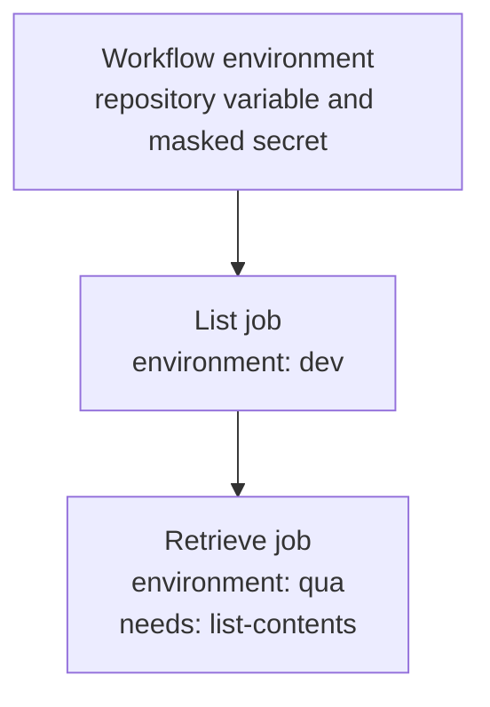

## Workflow 05 - Repository values

**Track:** Configuration

**Workflow:** [05-repo-values-workflow.yml](../.github/workflows/05-repo-values-workflow.yml)

**Associated prompt:** [13.05-create-05-repo-values-workflow.prompt.md](../.github/prompts/13.05-create-05-repo-values-workflow.prompt.md)

### Learning Objectives

* Map workflow-level env from repository `vars` and `secrets`.
* Sequence jobs with `needs:` and demonstrate fallback secret generation and masking.

### Conceptual Model

Workflow-level environment variables are available to jobs unless overridden. The `retrieve-values` job depends on `list-contents` with `needs: list-contents`.

### Prerequisites

* Fork repository. Optionally set repository variables and secrets in your fork to observe non-default paths.

### Workflow Walkthrough

* Define workflow-level `env:` mapping `REPO_VARIABLE` and `REPO_SECRET` from `vars` and `secrets`.
* `list-contents` runs under `environment: dev` and produces listings.
* `retrieve-values` runs under `environment: qua`, has `needs: list-contents`, and demonstrates reading `REPO_SECRET`, `QUA_SECRET`, and `QUA_VARIABLE`, with demo fallback values generated when secrets are absent.

### Run The Workflow

* Run manually from the Actions UI in your fork. To test repository-level secrets, add `REPO_LEVEL_SECRET` and `REPO_LEVEL_VARIABLE` in your fork settings and re-run.

### Inspect The Results

* Logs indicate whether secrets were sourced from repository or generated fallback defaults.
* `retrieve-repo-values` step prints the workflow-level env values (repo name, ref, REPO_LEVEL_VARIABLE) as echoed text.

### Experiment

* Add a repository variable `REPO_LEVEL_VARIABLE` in your fork and observe the workflow using it instead of the default.

### Security, Cost, And Cleanup

* Be mindful of secrets scope. Do not print secrets; the workflow demonstrates masking with `::add-mask::`.

### Success Criteria

* `retrieve-values` runs after `list-contents` and shows masked secret handling and repository variable consumption.

### Key Takeaways

* Use workflow-level env to centralize repository-scoped settings and secrets; use `needs` to serialize dependent jobs.

### Previous / Next

* Previous: [04-environments-workflow.md](04-environments-workflow.md)
* Next: [06-artifacts-workflow.md](06-artifacts-workflow.md)
