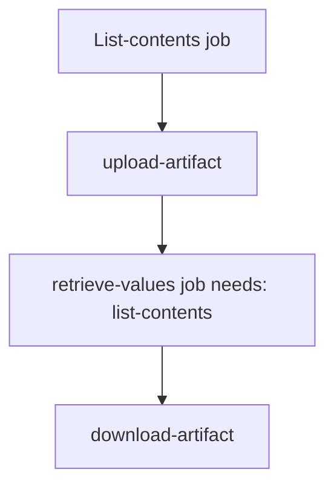

## Workflow 06 - Artifacts

**Track:** Data And Security

**Workflow:** [06-artifacts-workflow.yml](../.github/workflows/06-artifacts-workflow.yml)

**Associated prompt:** [13.06-create-06-artifacts-workflow.prompt.md](../.github/prompts/13.06-create-06-artifacts-workflow.prompt.md)

### Learning Objectives

* Upload artifacts from one job and download them in a dependent job.
* See how `actions/upload-artifact` and `actions/download-artifact` share files between jobs.

### Conceptual Model

One job creates files under an `artifacts/` directory and uses `actions/upload-artifact@v4`. A downstream job that `needs` the producer uses `actions/download-artifact@v4` to consume them.

### Prerequisites

* Fork the repo. No secrets required.

### Workflow Walkthrough

* `list-contents` job writes `artifacts/list-contents.txt` and `artifacts/variables-output.csv` and uploads them as artifact `list-contents`.
* `retrieve-values` job `needs: list-contents` and downloads artifact contents to `downloads/` for inspection.

### Run The Workflow

* Run `06-artifacts-workflow` manually from Actions UI in your fork.

### Inspect The Results

* Check `upload-artifact` step in producer job for successful upload confirmation.
* Check `download-artifact` step in consumer job for a successful download into `downloads/` and subsequent `Get-Content` or `Import-Csv` output.

### Experiment

* Modify producer to include additional files (logs, JSON) and re-run to see how artifacts persist in the run and are available for download from the Actions UI artifact tab.

### Security, Cost, And Cleanup

* Artifacts remain attached to the run and may be retained per repository artifact retention policies; delete artifacts from the run if they contain sensitive data.

### Success Criteria

* `retrieve-values` successfully downloads the `list-contents` artifact and prints its contents in logs.

### Key Takeaways

* Use artifacts to pass files between jobs within the same run. They are not a general-purpose storage solution and are retained according to retention settings.

### Previous / Next

* Previous: [05-repo-values-workflow.md](05-repo-values-workflow.md)
* Next: [07-permissions-workflow.md](07-permissions-workflow.md)
