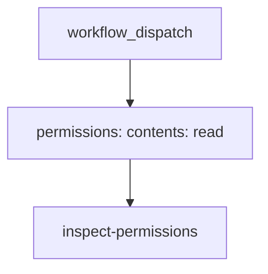

## Workflow 07 - Permissions

**Track:** Data And Security

**Workflow:** [07-permissions-workflow.yml](../.github/workflows/07-permissions-workflow.yml)

**Associated prompt:** [13.07-create-07-permissions-workflow.prompt.md](../.github/prompts/13.07-create-07-permissions-workflow.prompt.md)

### Learning Objectives

* Configure `permissions:` for `GITHUB_TOKEN` at workflow scope to minimize privileges.
* See how setting one permission narrows all unspecified scopes to `none`.

### Conceptual Model

Setting `permissions: contents: read` demonstrates least-privilege tokens; UI and logs show that the token cannot perform write operations.

### Prerequisites

* Fork repo. No secrets required.

### Workflow Walkthrough

* Top-level `permissions` are set to `contents: read`.
* `inspect-permissions` prints a message that the token is read-only and lists workflow files.

### Run The Workflow

Run `07-permissions-workflow` manually from your fork's Actions UI.

### Inspect The Results

* Step `show-workflow-context` should print the event name and note the token's read-only limitation.
* `list-workflow-files` shows which workflow YAML files are accessible under `.github/workflows`.

### Experiment

* Temporarily change `permissions` to include `pull-requests: write` in a fork to observe elevated capability (do not commit elevated permissions back upstream).

### Security, Cost, And Cleanup

* Demonstrates a security best practice: set the narrowest permissions required.

### Success Criteria

* The job runs and prints confirmation of `GITHUB_TOKEN` limited to `contents: read`.

### Key Takeaways

* Explicit `permissions` reduce the risk of over-privileged workflow runs.

### Previous / Next

* Previous: [06-artifacts-workflow.md](06-artifacts-workflow.md)
* Next: [08-timeouts-workflow.md](08-timeouts-workflow.md)
