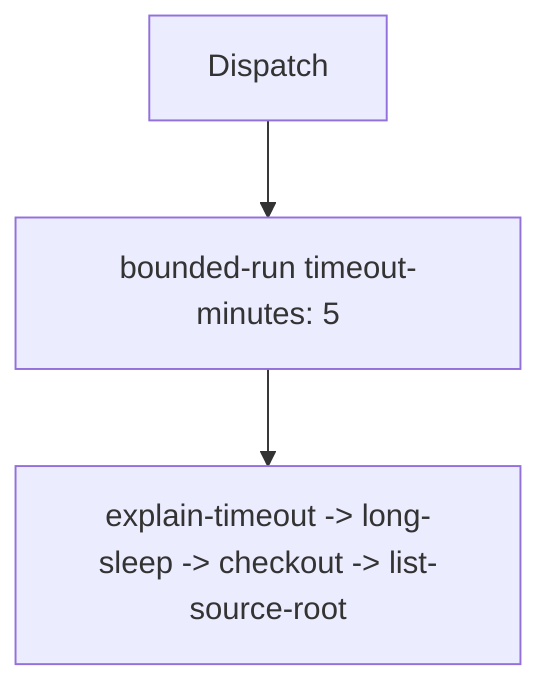

## Workflow 08 - Timeouts

**Track:** Data And Security

**Workflow:** [08-timeouts-workflow.yml](../.github/workflows/08-timeouts-workflow.yml)

**Associated prompt:** [13.08-create-08-timeouts-workflow.prompt.md](../.github/prompts/13.08-create-08-timeouts-workflow.prompt.md)

### Learning Objectives

* Use `timeout-minutes` to bound job runtime and trigger automatic cancellation.
* Observe how the runner cancels a job that exceeds the configured timeout.

### Conceptual Model

A job with `timeout-minutes: 5` will be cancelled by GitHub Actions if it runs longer than five minutes. The example sleeps 7 minutes to demonstrate cancellation behavior.

### Prerequisites

* Fork repository. No secrets are required.

### Workflow Walkthrough

* `bounded-run` sets `timeout-minutes: 5` and the `explain-timeout` step sleeps for 7 minutes (intentional) to illustrate cancellation.
* After cancellation, subsequent steps will not run.

### Run The Workflow

* Run `08-timeouts-workflow` manually from Actions UI in your fork and observe that the job is cancelled around the 5-minute mark.

### Inspect The Results

* The Actions UI shows the job status as `Cancelled` and logs the timestamp when cancellation occurred.
* Steps after the sleep are not executed.

### Experiment

* Reduce the sleep loop to 3 minutes in a fork to see a successful completion.

### Security, Cost, And Cleanup

* Helps prevent runaway compute usage in CI; no cloud costs incurred here.

### Success Criteria

* When run as provided, the job is cancelled by Actions due to timeout; when reduced sleep falls below timeout, the job completes.

### Key Takeaways

* Use `timeout-minutes` to protect against stuck or runaway jobs.

### Previous / Next

* Previous: [07-permissions-workflow.md](07-permissions-workflow.md)
* Next: [09-manual-inputs-workflow.md](09-manual-inputs-workflow.md) (created in the next implementation phase)
