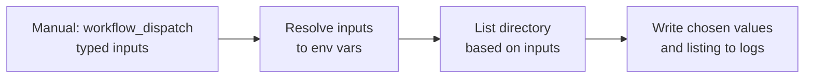

## Workflow 09 - Manual Inputs

**Track:** GitHub Actions Workflow Labs
**Workflow:** [09-manual-inputs-workflow.yml](../.github/workflows/09-manual-inputs-workflow.yml)
**Associated prompt:** [13.09-create-09-manual-inputs-workflow.prompt.md](../.github/prompts/13.09-create-09-manual-inputs-workflow.prompt.md)

### Learning Objectives

* Understand typed `workflow_dispatch` inputs (choice and boolean).
* Map manual inputs into environment variables for use in steps.
* Inspect run logs to verify chosen values and directory listings.

### Conceptual Model

Manual run inputs are resolved, mapped to environment variables, and then used
to control the inspection step that lists files or directories.

### Prerequisites

* Fork the repository and enable GitHub Actions in your fork.
* Familiarity with the Actions UI and how to run a workflow manually.

### Workflow Walkthrough

The live workflow declares only `workflow_dispatch` inputs (a choice
`target_folder` and a boolean `include_files`) and `contents: read` for the
runtime token. Although some prompt drafts suggested supporting pushes, use
the live YAML as truth: this workflow is manual-only. The `resolve-inputs`
step maps `${{ inputs.* }}` into environment variables; the listing step then
reads those env vars to either list files and directories or directories only.

Note: because the workflow is manual-only, any push-based fallback logic in
earlier prompt drafts is unreachable in the live file — do not rely on it.

### Run The Workflow

1. Open **Actions** in your fork.
2. Select **09-manual-inputs-workflow**.
3. Select **Run workflow**, choose a branch, select `target_folder` from the
   dropdown and `include_files` true/false, then start the run.

### Inspect The Results

* Confirm the logs show the chosen `target_folder` and `include_files` values.
* Confirm the `list-requested-folder` step prints a directory listing limited to
  the selected folder and respects the boolean choice.

### Experiment

* Try each `target_folder` option and observe differences in listings.
* In a fork or learner branch, add a short script under `scripts/` and run the
  workflow selecting `scripts` to verify visibility.

### Security, Cost, And Cleanup

* The workflow requests `contents: read` only — no secrets or write
  permissions are granted.
* Manual runs consume runner minutes; cancel any long-running runs.

### Success Criteria

* A manual run succeeds and the logs show the selected inputs and correct
  listing behavior.

### Key Takeaways

* `workflow_dispatch` supports typed inputs (choice, boolean) to make manual
  runs safer and clearer.
* Always treat the live YAML as the source of truth for trigger behavior.

### Previous / Next

Previous: [Workflow 08 - Timeouts](08-timeouts-workflow.md)
Next: [Workflow 10 - Run Names](10-show-commit-workflow.md)
