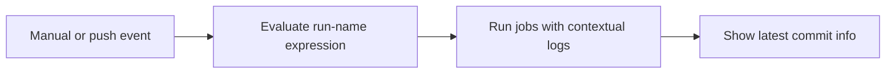

## Workflow 10 - Run Names

**Track:** GitHub Actions Workflow Labs
**Workflow:** [10-show-commit-workflow.yml](../.github/workflows/10-show-commit-workflow.yml)
**Associated prompt:** [13.10-create-10-run-name-workflow.prompt.md](../.github/prompts/13.10-create-10-run-name-workflow.prompt.md)

### Learning Objectives

* Understand `run-name` expressions and how they appear in the Actions UI.
* Verify run metadata such as `github.actor` and `github.ref_name` in logs.
* Inspect the latest commit printed by the workflow to confirm repository state.

### Conceptual Model

`run-name` templates are evaluated before the run appears in the Actions UI so
that runs are easier to identify by actor and ref.

### Prerequisites

* Fork the repository and enable GitHub Actions.

### Workflow Walkthrough

The live workflow sets `run-name` to include the actor and ref name. The
`show-latest-commit` step runs `git log -1 --oneline` after checkout to show
the single latest commit, providing quick evidence of the exact commit used
for the run.

### Run The Workflow

1. Open **Actions** in your fork.
2. Select **10-show-commit-workflow** and choose **Run workflow**.

### Inspect The Results

* Confirm the run entry name in the Actions list reflects the evaluated
  `run-name` (actor and ref).
* In the job logs, confirm `git log -1 --oneline` prints the latest commit.

### Experiment

* Trigger a run from a feature branch to observe the `ref_name` change in the
  evaluated run name.

### Security, Cost, And Cleanup

* The workflow uses `contents: read` only. No secrets are required.

### Success Criteria

* Run name in the Actions UI includes the actor and ref name.
* Logs contain the one-line latest commit message and SHA.

### Key Takeaways

* `run-name` improves run discoverability in the Actions UI.

### Previous / Next

Previous: [Workflow 09 - Manual Inputs](09-manual-inputs-workflow.md)
Next: [Workflow 11 - Event Filters](11-event-filters-workflow.md)
