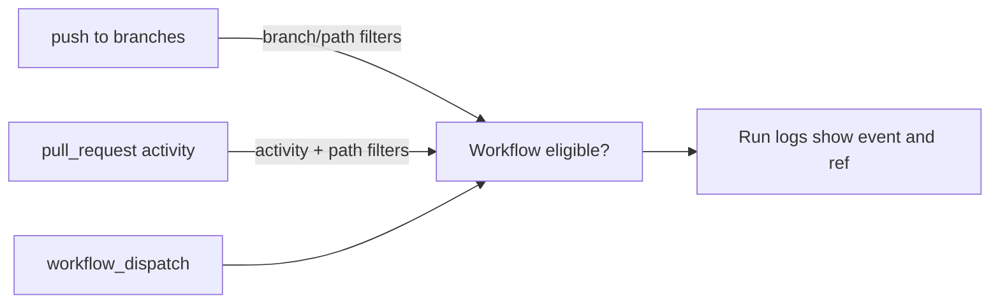

## Workflow 11 - Event Filters

**Track:** GitHub Actions Workflow Labs
**Workflow:** [11-event-filters-workflow.yml](../.github/workflows/11-event-filters-workflow.yml)
**Associated prompt:** [13.11-create-11-event-filters-workflow.prompt.md](../.github/prompts/13.11-create-11-event-filters-workflow.prompt.md)

### Learning Objectives

* Understand branch, path, and pull request activity filters.
* Inspect the live workflow file to verify which filters are configured.
* Recognize that the live YAML in this repository is an inspection scaffold
  and may not yet implement all filter behaviors.

### Conceptual Model

This workflow is intentionally lightweight: it prints the event and ref, and
then prints the beginning of its own YAML so learners can confirm which
filters would be applied when the filters are implemented.

### Prerequisites

* Fork the repository and enable Actions in the fork.

### Workflow Walkthrough

The live file exposes filter examples but is a safe inspection scaffold: it
runs on `workflow_dispatch` and prints the workflow file contents for review.
It does not enforce branch/path matching in the runner because the live file
is intentionally focused on teaching the filter syntax.

Safe experiment: implement branch/path filters in a learner branch only and
test with non-production branches to avoid creating trigger loops or
unintentional automation that affects protected branches.

### Run The Workflow

1. Open **Actions** in your fork and select **11-event-filters-workflow**.
2. Use **Run workflow** to inspect the configured filters in the logs.

### Inspect The Results

* Confirm logs show `github.event_name` and `github.ref` values.
* Confirm the `show-filtered-files` step prints the top lines of
  `.github/workflows/11-event-filters-workflow.yml` so you can read the
  declared filters directly in the Actions log.

### Experiment

* In a learner branch, add real branch/path filters and observe whether pushes
  or pull request events trigger the workflow as expected. Avoid experimenting
  on protected branches or triggering external hooks.

### Security, Cost, And Cleanup

* No elevated permissions are requested in the live workflow.

### Success Criteria

* Learners can read the filter YAML from the run logs and explain how the
  filters would restrict runs when active.

### Key Takeaways

* Filters reduce noise by restricting runs to relevant branches, paths, or
  PR activity types.

### Previous / Next

Previous: [Workflow 10 - Run Names](10-show-commit-workflow.md)
Next: [Workflow 12 - Job Outputs](12-job-outputs-workflow.md)
