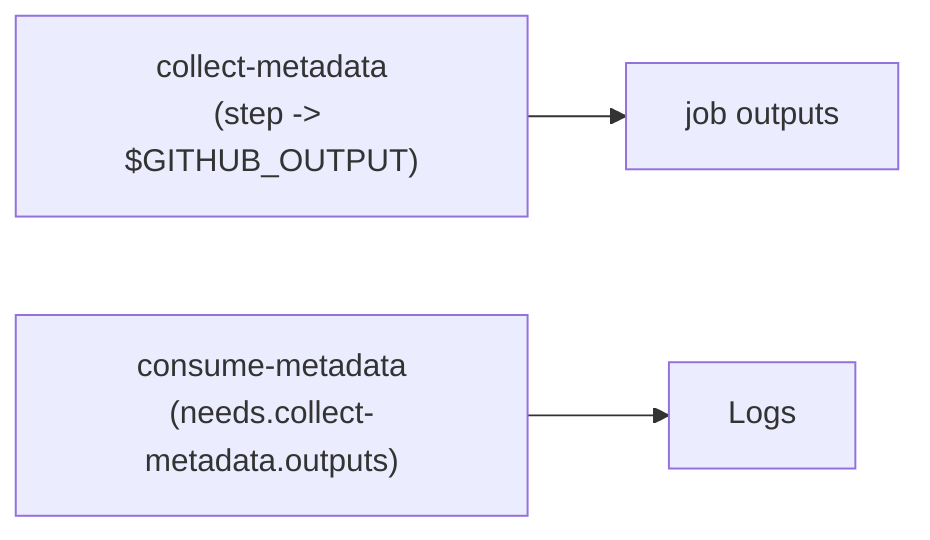

## Workflow 12 - Job Outputs

**Track:** GitHub Actions Workflow Labs
**Workflow:** [12-job-outputs-workflow.yml](../.github/workflows/12-job-outputs-workflow.yml)
**Associated prompt:** [13.12-create-12-job-outputs-workflow.prompt.md](../.github/prompts/13.12-create-12-job-outputs-workflow.prompt.md)

### Learning Objectives

* Understand step outputs, job outputs, and how to consume them via `needs`.
* Map values to `$GITHUB_OUTPUT` and read them in downstream jobs.

### Conceptual Model

Step outputs written to `$GITHUB_OUTPUT` are promoted to job outputs and
exposed to downstream jobs through the `needs.<job_id>.outputs` context.

### Prerequisites

* Fork the repository and enable Actions.

### Workflow Walkthrough

`collect-metadata` writes `branch_name` and `short_sha` to `$GITHUB_OUTPUT`
and declares them as job outputs. The `consume-metadata` job uses `needs` to
access those outputs and prints them.

### Run The Workflow

1. Open **Actions** → **12-job-outputs-workflow** → **Run workflow**.

### Inspect The Results

* Confirm `collect-metadata` writes `branch_name` and `short_sha` in its
  step output logs.
* Confirm `consume-metadata` prints values read from
  `needs.collect-metadata.outputs.branch_name` and `short_sha`.

### Experiment

* Modify the `prepare-metadata` step in a learner branch to expose additional
  values and observe how downstream consumers read them.

### Security, Cost, And Cleanup

* No extra permissions are required for this demonstration.

### Success Criteria

* Downstream job successfully receives and prints values from the upstream
  job outputs.

### Key Takeaways

* Use `$GITHUB_OUTPUT` to export step-level values and declare them in the
  job `outputs` mapping for downstream access.

### Previous / Next

Previous: [Workflow 11 - Event Filters](11-event-filters-workflow.md)
Next: [Workflow 13 - Matrix Strategy](13-matrix-workflow.md)
