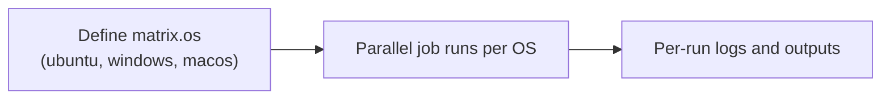

## Workflow 13 - Matrix Strategy

**Track:** GitHub Actions Workflow Labs
**Workflow:** [13-matrix-workflow.yml](../.github/workflows/13-matrix-workflow.yml)
**Associated prompt:** [13.13-create-13-matrix-workflow.prompt.md](../.github/prompts/13.13-create-13-matrix-workflow.prompt.md)

### Learning Objectives

* Understand the matrix strategy for running jobs across multiple OS runners.
* Observe platform-specific logs and consider runner cost implications.

### Conceptual Model

A matrix expands into separate job runs per matrix axis value; each run is
charged against the chosen runner's billing rate.

### Prerequisites

* A fork with Actions enabled. Note that macOS jobs increase cost and may be
  slower to queue; consider whether macOS is needed for your experiment.

### Workflow Walkthrough

The live workflow defines `matrix.os` with `ubuntu-latest`, `windows-latest`,
and `macos-latest`. The job lists staged workflow files using PowerShell so
the same step works on all three platforms.

### Run The Workflow

1. Open **Actions** → **13-matrix-workflow** → **Run workflow**.

### Inspect The Results

* Confirm three job runs appear (one per OS) and inspect each log for the
  printed `matrix.os` value.

### Experiment

* Remove or add an OS value in a learner branch to observe the effect on the
  number of jobs and runner-minute consumption.

### Security, Cost, And Cleanup

* macOS runners are billed at a higher rate; use them sparingly for exercises.

### Success Criteria

* Separate jobs run for each matrix OS and print the expected platform info.

### Key Takeaways

* Matrix strategies let you test cross-platform behavior with minimal YAML.

### Previous / Next

Previous: [Workflow 12 - Job Outputs](12-job-outputs-workflow.md)
Next: [Workflow 14 - Error Handling](14-error-handling-workflow.md)
