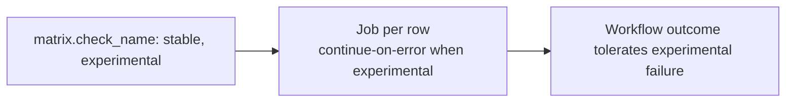

## Workflow 14 - Error Handling

**Track:** GitHub Actions Workflow Labs
**Workflow:** [14-error-handling-workflow.yml](../.github/workflows/14-error-handling-workflow.yml)
**Associated prompt:** [13.14-create-14-error-handling-workflow.prompt.md](../.github/prompts/13.14-create-14-error-handling-workflow.prompt.md)

### Learning Objectives

* Understand `continue-on-error` at the job level for experimental matrix rows.
* Observe how workflow outcome differs when one matrix row is tolerated.

### Conceptual Model

`continue-on-error` allows specific jobs or matrix rows to fail without
marking the entire workflow as failed. The live workflow currently prints a
successful message for both rows; see the safe experiment below to observe a
failing experimental row.

### Prerequisites

* Fork with Actions enabled.

### Workflow Walkthrough

The job sets `continue-on-error` dynamically when the matrix `check_name`
equals `experimental`. The live run prints messages for each row. To safely
observe a failure, limit experiments to a learner branch and change only the
experimental row's simulate step to exit 1.

### Run The Workflow

1. Open **Actions** → **14-error-handling-workflow** → **Run workflow**.

### Inspect The Results

* Confirm two matrix rows ran and the run summary shows whether the workflow
  concluded success or tolerated a failure.

### Experiment

* In a temporary branch, modify the `simulate-check-result` step to `exit 1`
  for the `experimental` row only. Run the workflow in that branch to confirm
  that the workflow as a whole remains successful while the experimental job
  is marked failed or neutral according to `continue-on-error` semantics.

### Security, Cost, And Cleanup

* No special permissions are required. Clean up any temporary branches used for
  experimentation.

### Success Criteria

* Learners can demonstrate that the experimental row failure does not fail
  the entire workflow when `continue-on-error` is set.

### Key Takeaways

* `continue-on-error` is useful for experimental checks that are informative
  but non-blocking for pipeline success.

### Previous / Next

Previous: [Workflow 13 - Matrix Strategy](13-matrix-workflow.md)
Next: [Workflow 15 - Dependency Cache](15-dependency-cache-workflow.md)
