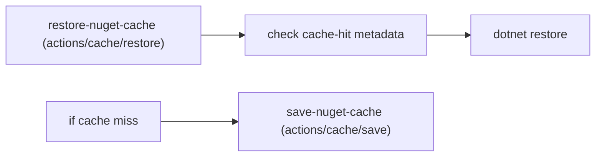

## Workflow 15 - Dependency Cache

**Track:** GitHub Actions Workflow Labs
**Workflow:** [15-dependency-cache-workflow.yml](../.github/workflows/15-dependency-cache-workflow.yml)
**Associated prompt:** [13.15-create-15-dependency-cache-workflow.prompt.md](../.github/prompts/13.15-create-15-dependency-cache-workflow.prompt.md)

### Learning Objectives

* Understand separate restore and save cache actions and their metadata outputs.
* Observe first-run vs. subsequent-run behavior when a cache is present.
* Understand caching risks when keys are broad and may restore unrelated data.

### Conceptual Model

The `restore` step exposes outputs such as `cache-hit`, `cache-primary-key`,
and `cache-matched-key`. If the cache was a miss, the workflow restores
dependencies and then saves the populated cache using the primary key.

### Prerequisites

* The calculator solution must exist at `src/workspace/calculator-xunit-testing`.
  If you reset the workspace, restore it using the `calculator-setup` skill or
  copy the completed solution from `src/completed/`.

### Workflow Walkthrough

The live workflow uses `actions/cache/restore@v4` and `actions/cache/save@v4`
with a key that includes `${{ runner.os }}` and `hashFiles` of project files.
It prints `cache-hit` and key metadata and runs `dotnet restore` before saving
the cache only when a miss occurred.

Note: Broad restore keys (for example, prefix-only keys) may restore unrelated
content across runs; choose keys carefully to avoid pulling stale or
incompatible packages.

### Run The Workflow

1. Open **Actions** → **15-dependency-cache-workflow** → **Run workflow**.

### Inspect The Results

* Confirm `restore-nuget-cache` outputs `cache-hit` and key values.
* On first run, expect `cache-hit=false` and then a `save-nuget-cache` step to
  upload the populated cache.
* On subsequent runs with the same key, expect `cache-hit=true` and no save.

### Experiment

* Change a project file (affecting `hashFiles`) to observe cache miss and new
  upload. Use a learner branch to avoid affecting shared cache expectations.

### Security, Cost, And Cleanup

* Cache storage is not private; avoid caching secrets or credentials. Cache
  uploads consume bandwidth and storage — remove large unnecessary caches.

### Success Criteria

* Learners can demonstrate the difference between first-run cache miss and
  subsequent-run cache hit behavior and read cache metadata from the logs.

### Key Takeaways

* Separate restore and save steps make cache logic explicit and enable
  metadata-driven decisions in workflows.

### Previous / Next

Previous: [Workflow 14 - Error Handling](14-error-handling-workflow.md)
Next: [Workflow 16 - Concurrency](16-concurrency-workflow.md)
