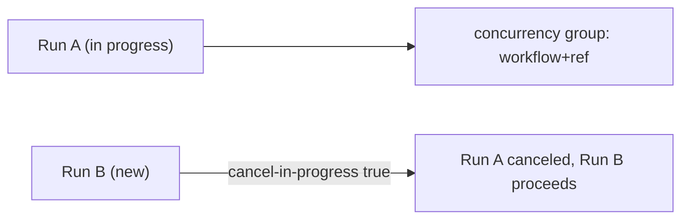

## Workflow 16 - Concurrency

**Track:** GitHub Actions Workflow Labs
**Workflow:** [16-concurrency-workflow.yml](../.github/workflows/16-concurrency-workflow.yml)
**Associated prompt:** [13.16-create-16-concurrency-workflow.prompt.md](../.github/prompts/13.16-create-16-concurrency-workflow.prompt.md)

### Learning Objectives

* Understand `concurrency.group` and `cancel-in-progress` semantics.
* Observe cancellation behavior when multiple runs are dispatched quickly.

### Conceptual Model

The concurrency group expression in the live workflow includes `github.workflow`
and `github.ref` so only runs for the same workflow and ref cancel each other.

### Prerequisites

* Fork the repository and enable Actions.

### Workflow Walkthrough

The workflow uses `concurrency.group: ${{ github.workflow }}-${{ github.ref }}`
and `cancel-in-progress: true`. The job waits three minutes to provide a
window for another run to start and demonstrate cancellation.

### Run The Workflow

1. Open **Actions** → **16-concurrency-workflow**.
2. Run it twice in quick succession (from the same ref) to observe cancellation.

### Inspect The Results

* The earlier run should be canceled and show a cancellation status in the
  Actions UI while the later run continues.

### Experiment

* Dispatch a run on two different branches (refs) to see that groups are
  scoped by ref and do not cancel each other.

### Security, Cost, And Cleanup

* Canceling in-progress runs avoids wasted runner minutes when newer runs
  supersede older ones.

### Success Criteria

* Learners can demonstrate that a later run cancels an earlier run when both
  share the same concurrency group key.

### Key Takeaways

* Concurrency groups prevent duplicate work for the same workflow and ref.

### Previous / Next

Previous: [Workflow 15 - Dependency Cache](15-dependency-cache-workflow.md)
Next: [Workflow 17 - Run Defaults](17-run-defaults-workflow.md)
