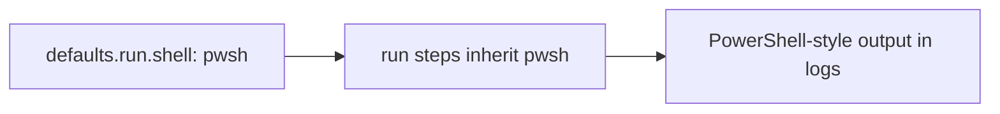

## Workflow 17 - Run Defaults

**Track:** GitHub Actions Workflow Labs
**Workflow:** [17-run-defaults-workflow.yml](../.github/workflows/17-run-defaults-workflow.yml)
**Associated prompt:** [13.17-create-17-run-defaults-workflow.prompt.md](../.github/prompts/13.17-create-17-run-defaults-workflow.prompt.md)

### Learning Objectives

* Learn how `defaults.run.shell` configures the default shell for all `run`
  steps in a workflow.
* Observe how steps use PowerShell syntax without per-step `shell` overrides.

### Conceptual Model

Workflow-level run defaults simplify authoring by removing repeated step-level
`shell` declarations for homogeneous step styles.

### Prerequisites

* Fork and enable Actions. Use a runner that supports the chosen shell.

### Workflow Walkthrough

The live workflow sets `defaults.run.shell` to `pwsh` so all `run` steps use
PowerShell syntax unless a step overrides `shell`. The `list-workflow-count`
step uses PowerShell cmdlets to list workflow files.

### Run The Workflow

1. Open **Actions** → **17-run-defaults-workflow** → **Run workflow**.

### Inspect The Results

* Confirm the `show-default-shell` and `list-workflow-count` steps run using
  PowerShell syntax and print expected outputs.

### Experiment

* In a learner branch, override a single step with `shell: bash` to see an
  alternative shell behavior for that step only.

### Security, Cost, And Cleanup

* No special permissions required. Be mindful that some shells are not
  available on all runner types; test platform compatibility when overriding.

### Success Criteria

* Steps run with PowerShell semantics without step-level shell declarations.

### Key Takeaways

* `defaults.run.shell` reduces repetition and centralizes shell selection.

### Previous / Next

Previous: [Workflow 16 - Concurrency](16-concurrency-workflow.md)
Next: [Workflow 18 - Service Containers](18-service-containers-workflow.md)
