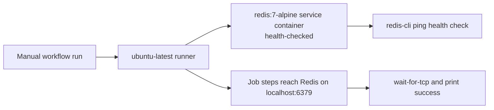

## Workflow 18 - Service Containers

**Track:** GitHub Actions Workflow Labs
**Workflow:** [18-service-containers-workflow.yml](../.github/workflows/18-service-containers-workflow.yml)
**Associated prompt:** [13.18-create-18-service-containers-workflow.prompt.md](../.github/prompts/13.18-create-18-service-containers-workflow.prompt.md)

### Learning Objectives

* Demonstrate a service container started for a job on a Linux runner.
* Configure a container health check and expose the service port to the runner.
* Explain fork-safety and risks of unpinned images.

### Conceptual Model

A single job runs on a Linux runner which starts a Redis service container. The
service exposes port 6379 and the runner accesses it at localhost:6379 once the
health check passes.

### Prerequisites

* Fork the repository and enable Actions in your fork.
* Use a Linux runner (service containers require Linux runners in this lab).

### Workflow Walkthrough

The workflow defines `verify-redis-service` on `ubuntu-latest` with a
short timeout. A service container named `redis` uses `redis:7-alpine` and
defines a `redis-cli ping` health check with retry and timeout settings. The
job steps explain the service, wait for TCP connectivity on `127.0.0.1:6379`,
then print a success message.

### Run The Workflow

1. Open Actions in your fork and choose **Workflow 18 - Service Containers**.
2. Start a manual workflow run.

### Inspect The Results

* Confirm the job used `ubuntu-latest` and started a `redis` service.
* Verify the health check logs show successful `PONG` responses.
* Confirm the runner steps connected to `127.0.0.1:6379` and printed success.

### Experiment

* Replace `redis:7-alpine` with an unpinned tag such as `redis:latest` and
  observe image-upgrade or reproducibility risks.

### Security, Cost, And Cleanup

* Service containers run only for the job lifetime and are cleaned up
  automatically by GitHub Actions.
* Unpinned images (for example `:latest`) can change between runs; prefer
  pinned digests for durable production pipelines.
* Health checks reduce flakiness but may extend runner minutes if misconfigured.

### Success Criteria

* The job starts a Redis service and the runner connects to localhost:6379.
* Health checks complete and the verify step prints a success message.

### Key Takeaways

* Service containers provide ephemeral, job-scoped services reachable from the
  runner at localhost when using a Linux runner.
* Use pinned images for production; health checks improve reliability.

### Previous / Next

Previous: [Workflow 17 - Run Defaults](17-run-defaults-workflow.md)
Next: [Workflow 19 - Reusable Workflow With Outputs](19-called-workflow.md)
