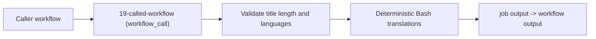

## Workflow 19 - Reusable Workflow With Outputs

**Track:** GitHub Actions Workflow Labs
**Workflow:** [19-called-workflow.yml](../.github/workflows/19-called-workflow.yml)
**Associated prompt:** [13.19-create-19-workflow-call-workflow.prompt.md](../.github/prompts/13.19-create-19-workflow-call-workflow.prompt.md)

### Learning Objectives

* Understand `workflow_call` inputs and outputs.
* Validate input lengths and enumerated language values.
* Promote step outputs to job and workflow outputs.

### Conceptual Model

Reusable workflows accept typed inputs, run one or more jobs, and expose
workflow-level outputs that callers can consume. Validation at the called
workflow boundary ensures consistent rules for all callers.

### Prerequisites

* Fork and enable Actions.
* Do not call the reusable workflow from workflows outside its intended test
  contexts without checking `workflow_call` policies and access controls.

### Workflow Walkthrough

The called workflow defines required string inputs: `report_title`,
`source_language`, `target_language`, and `caller_workflow`. It runs a single
job `reusable-report` on `ubuntu-latest`, validates `report_title` length
(max 128 chars), validates languages against `en`, `fr`, `de`, and `nl-BE`,
performs deterministic translations via a Bash `case` statement, and writes
`translated_title` to `$GITHUB_OUTPUT` so it becomes a job output and then a
workflow output.

### Run The Workflow

This workflow is `workflow_call`-only and cannot be run directly. Use one of
the caller workflows in this lesson (Workflow 20 or 21) or call it from a
repository that supports `workflow_call` to test its behavior.

### Inspect The Results

* Confirm that invalid titles longer than 128 characters cause the job to
  fail with an actionable message.
* Confirm that attempting an unsupported language pair fails with an
  actionable error rather than returning an unrelated sample.
* Confirm that when source and target languages are identical, the original
  title is returned unchanged.

### Experiment

* Create a caller workflow that passes different titles and language pairs to
  observe deterministic translations and error handling.

### Security, Cost, And Cleanup

* The workflow requests only `contents: read` permission for `GITHUB_TOKEN`.
* Do not add secrets or external API calls to the reusable workflow.

### Success Criteria

* Caller workflows can successfully call this workflow and read the
  `translated_title` workflow output.
* Title length and language validations are enforced at the called workflow
  boundary.

### Key Takeaways

* `workflow_call` provides a stable boundary for shared validation and output
  production.
* Promotion of step outputs to job and workflow outputs enables clean caller
  consumption.

### Previous / Next

Previous: [Workflow 18 - Service Containers](18-service-containers-workflow.md)
Next: [Workflow 20 - Local Caller Workflow](20-caller-workflow.md)
