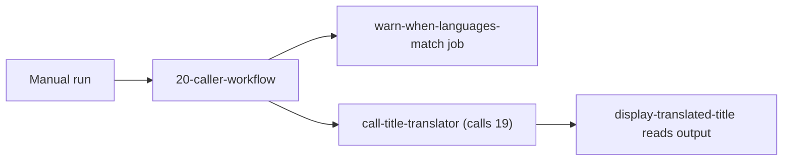

## Workflow 20 - Local Caller Workflow

**Track:** GitHub Actions Workflow Labs
**Workflow:** [20-caller-workflow.yml](../.github/workflows/20-caller-workflow.yml)
**Associated prompt:** [13.20-create-20-reusable-call-workflow.prompt.md](../.github/prompts/13.20-create-20-reusable-call-workflow.prompt.md)

### Learning Objectives

* Call a reusable workflow within the same repository using `workflow_call`.
* Pass inputs and consume workflow outputs in a dependent job.
* Observe warning patterns when inputs are identical.

### Conceptual Model

The caller workflow runs on manual dispatch, optionally warns when languages
match, calls the local `19-called-workflow.yml` at the job level, and then
displays the returned `translated_title`.

### Prerequisites

* Fork and enable Actions.

### Workflow Walkthrough

`20-reusable-call-workflow` sets a default `report_title` of
`The quick brown fox jumps over the lazy dog`. It defines choice inputs for
`source_language` and `target_language` limited to `en`, `fr`, `de`, and
`nl-BE`. A small `warn-when-languages-match` job emits a warning when the
two languages are identical. The `call-title-translator` job calls the local
`19-called-workflow.yml` at the job level, passing inputs and
`${{ github.workflow }}` for `caller_workflow`. A dependent job prints the
original and translated titles.

### Run The Workflow

1. Open Actions → **Workflow 20 - Local Caller Workflow** → **Run workflow**.
2. Leave the `report_title` default or provide another supported title.

### Inspect The Results

* Confirm the warning job emits when source and target languages match.
* Confirm `call-title-translator` returns `translated_title` consumed by the
  `display-translated-title` job.

### Experiment

* Change inputs to unsupported languages to observe the called workflow's
  validation failure behavior.

### Security, Cost, And Cleanup

* The caller uses only `contents: read` for `GITHUB_TOKEN` and does not use
  secrets. Validation remains in Workflow 19 to keep caller logic simple.

### Success Criteria

* The caller produces the `translated_title` output and the display job prints
  the expected deterministic translation when configured.

### Key Takeaways

* Local reusable workflow calls use a relative
  `./.github/workflows/<file>.yml` path at the job level.
* Keep validation centralized in the called workflow to ensure consistent
  behavior across callers.

### Previous / Next

Previous: [Workflow 19 - Reusable Workflow With Outputs](19-called-workflow.md)
Next: [Workflow 21 - Reuse With Different Defaults](21-caller-workflow.md)
