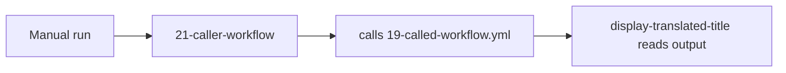

## Workflow 21 - Reuse With Different Defaults

**Track:** GitHub Actions Workflow Labs
**Workflow:** [21-caller-workflow.yml](../.github/workflows/21-caller-workflow.yml)
**Associated prompt:** [13.21-create-21-reusable-call-workflow.prompt.md](../.github/prompts/13.21-create-21-reusable-call-workflow.prompt.md)

### Learning Objectives

* Show reusability by creating a second caller with a different default title.
* Demonstrate quoting expressions when inputs contain colons.

### Conceptual Model

This lesson shows how the same reusable workflow can be called from multiple
caller workflows that provide different default values and quoting rules.

### Prerequisites

* Fork and enable Actions.

### Workflow Walkthrough

`21-reusable-call-workflow` sets the default `report_title` to
`Advances in Neural Information Processing Systems: Attention is All You Need, 2027`.
Because the title contains a colon, the caller quotes the expression when
passing it to the called workflow to avoid YAML parsing or expression pitfalls.
The workflow warns when languages match, calls the local `19-called-workflow.yml`,
and prints the translated title in a dependent job.

### Run The Workflow

1. Open Actions → **Workflow 21 - Reuse With Different Defaults** → **Run workflow**.

### Inspect The Results

* Confirm the called workflow returns the deterministic translation for the
  Attention title rather than the quick-brown-fox sample.
* Confirm the caller quoted the `report_title` expression when passing it to
  the called workflow.

### Experiment

* Create another caller with a different default title and observe reuse.

### Security, Cost, And Cleanup

* Same guidance as Workflow 20: `contents: read` only, no secrets.

### Success Criteria

* The caller returns a translator output specific to the Attention title.
* Quoting prevents expression parsing issues when passing values with colons.

### Key Takeaways

* Reusable workflows are more powerful when callers supply varied defaults.
* Quote complex `report_title` expressions to preserve literal punctuation.

### Previous / Next

Previous: [Workflow 20 - Local Caller Workflow](20-caller-workflow.md)
Next: [Workflow 22 - Cross-Repository Call Template](22-caller-workflow.md)
