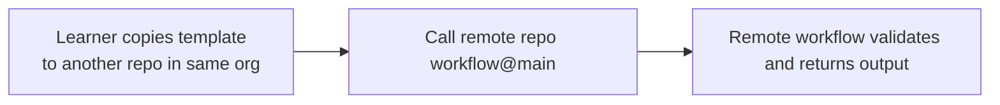

## Workflow 22 - Cross-Repository Call Template

**Track:** GitHub Actions Workflow Labs
**Workflow:** [22-caller-workflow.yml](../.github/workflows/22-caller-workflow.yml)
**Associated prompt:** [13.22-create-22-reusable-call-workflow.prompt.md](../.github/prompts/13.22-create-22-reusable-call-workflow.prompt.md)

### Learning Objectives

* Inspect a template that calls a reusable workflow in another repository in
  the same organization.
* Understand Actions access policies, `owner/repo/path@ref` syntax, and the
  mutability of `@main`.

### Conceptual Model

This file is a committed template intended to be copied to a different
repository before running. To study same-organization private repository
access policy specifically, use a private called repository configured to
allow access from the caller repository. A public called workflow can be
consumed more broadly when the caller's Actions policy allows it.

### Prerequisites

* Fork this repository and copy the committed file to another repository before running it.
* For the same-organization policy scenario, use a private called repository
  and verify that its Actions access settings allow the caller repository.

### Workflow Walkthrough

The template calls `multi-layer-perceptron/ghcp-dotnet-calculator/.github/workflows/19-called-workflow.yml@main`.
It passes inputs, including `${{ github.workflow }}` as `caller_workflow`, and
displays `translated_title` returned by the remote called workflow. The file
includes comments noting that `@main` is mutable and recommending replacing
`@main` with a release tag or commit SHA for durable usage.

### Run The Workflow

1. Copy this committed template to a repository in the same organization.
2. Verify Actions access and call permissions for both repositories.
3. Trigger the workflow manually in the copied repository.

### Inspect The Results

* Confirm the remote call succeeded under the caller and called repository policies.
* Confirm `translated_title` is returned and consumed by the dependent job.

### Experiment

* Replace `@main` with a release tag or commit SHA in the remote path and
  observe the durable reference behavior.

### Security, Cost, And Cleanup

* Cross-repository calls depend on called-repo and organization Actions
  policies; confirm them before running.
* The committed template in this repository should not be executed here to
  claim cross-repository behavior — copy it to a different repo first.

### Success Criteria

* Learners can copy the template to another repo in the same organization
  and run the workflow successfully when policies permit.

### Key Takeaways

* Use `owner/repo/path@ref` to call workflows in other repositories.
* Replace `@main` with a tag or SHA for stable references in production.

### Previous / Next

Previous: [Workflow 21 - Reuse With Different Defaults](21-caller-workflow.md)
Next: [Workflow 23 - Cross-Organization Call Template](23-caller-workflow.md)
