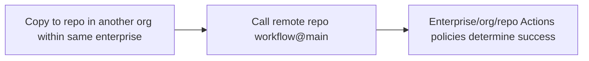

## Workflow 23 - Cross-Organization Call Template

**Track:** GitHub Actions Workflow Labs
**Workflow:** [23-caller-workflow.yml](../.github/workflows/23-caller-workflow.yml)
**Associated prompt:** [13.23-create-23-reusable-call-workflow.prompt.md](../.github/prompts/13.23-create-23-reusable-call-workflow.prompt.md)

### Learning Objectives

* Inspect a template that calls a reusable workflow in another organization
  within the same enterprise.
* Understand enterprise, organization, and repository-level Actions policies
  that affect cross-organization calls.

### Conceptual Model

This committed template demonstrates remote call syntax. To demonstrate a
cross-organization enterprise trust boundary rather than a generic public
workflow call, use a private or internal called repository and a caller in
another organization governed by the same GitHub Enterprise account.

### Prerequisites

* Copy this template to a repository in another organization that shares the
  same GitHub Enterprise account.
* Use a private or internal called repository for the enterprise access-policy exercise.
* Verify enterprise and organization Actions policies allow cross-org
  workflow calls and that the called repository permits `workflow_call`.

### Workflow Walkthrough

The template calls `multi-layer-perceptron/ghcp-dotnet-calculator/.github/workflows/19-called-workflow.yml@main`.
It passes inputs, including `${{ github.workflow }}` as `caller_workflow`, and
displays the returned `translated_title`. Comments explain that `@main` is
mutable and recommend using a tag or commit SHA for stable references.

### Run The Workflow

1. Copy this file to a repository in another organization under the same
   enterprise.
2. Confirm enterprise and organization Actions policies allow cross-org calls.
3. Manually trigger the workflow in the copied repository.

### Inspect The Results

* Confirm the run succeeds only when the applicable enterprise, organization,
  and repository Actions policies permit the private or internal call.
* Confirm `translated_title` is returned and displayed by the dependent job.

### Experiment

* Compare behavior when `@main` is used versus a fixed commit SHA or tag.

### Security, Cost, And Cleanup

* Cross-organization calls require explicit trust and policy configuration at
  the enterprise and organization levels. Personal accounts cannot emulate
  enterprise topology for this lesson.

### Success Criteria

* Learners can copy the template to a repository in another organization and
  run it successfully when the enterprise and org policies permit the call.

### Key Takeaways

* Enterprise and organization Actions settings control cross-organization
  workflow calls.
* Use immutable refs (tag or SHA) for reproducible cross-repo calls.

### Previous / Next

Previous: [Workflow 22 - Cross-Repository Call Template](22-caller-workflow.md)
Next: [Workflow 24 - Deploy Resources Guide](24-deploy-resources-workflow.md)
