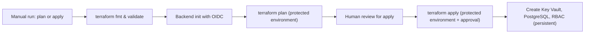

## Workflow 24 - Deploy Resources Guide

**Track:** GitHub Actions Workflow Labs
**Workflow:** [24-deploy-resources-workflow.yml](../.github/workflows/24-deploy-resources-workflow.yml)
**Associated prompt:** [13.24-create-24-deploy-resources-workflow.prompt.md](../.github/prompts/13.24-create-24-deploy-resources-workflow.prompt.md)

### Learning Objectives

* Prepare a fork-safe Terraform plan/apply workflow that uses GitHub OIDC.
* Understand plan-first review, protected environments, and the cost and
  security implications of persistent state storage.
* Recognize Key Vault purge protection and soft-delete implications for cleanup.

### Conceptual Model



This workflow performs a fork-safe Terraform plan or apply against the
infrastructure under `infra/terraform/24-postgresql-flexible-server/`. It
requires learner-provided Azure federation, IDs, an existing resource group,
and globally unique names for Key Vault and PostgreSQL.

### Prerequisites

* Fork and enable Actions; configure your own Azure OIDC federation for the
  repository using a federated application client ID.
* Complete the Azure and Workflow 24 checkpoints in the
  [Codespaces setup and lifecycle guide](../docs/codespaces-guide.md).
* Provide your Azure Tenant ID, Subscription ID, existing Resource Group
  name, location, application name, Key Vault name, and PostgreSQL server
  name as workflow inputs. Do not use real IDs or emails in shared content.
* Pre-provision the Terraform state resource group, storage account, and blob
  container, then provide their names as workflow inputs.
* Add `POSTGRES_ADMIN_PASSWORD` as a repository secret.
* Configure separate federated credentials for
  `repo:<owner>/<repo>:environment:plan` and
  `repo:<owner>/<repo>:environment:apply`.
* Grant the OIDC principal `Contributor` on the deployment resource group,
  `Storage Blob Data Contributor` on the state container or account, and the
  narrowest role that can create Key Vault role assignments, such as
  `Role Based Access Control Administrator` at the deployment scope.
* Configure required reviewers on the fork's `apply` environment.

### Workflow Walkthrough

The workflow exposes a required `terraform_action` input with choices `plan`
and `apply`, defaulting to `plan`. It sets `contents: read` and `id-token:
write` permissions. The workflow runs terraform `fmt` and `validate` first.
It initializes the pre-provisioned `azurerm` backend using OIDC credentials and
then runs `terraform plan`. When `terraform_action` is `apply`, the workflow
runs in a protected `apply` environment that requires reviewer approval before
continuing when the learner has configured required reviewers. The apply job
recalculates the configuration with `terraform apply`; it does not consume the
plan file produced by an earlier run. Apply stores PostgreSQL credentials in
the Key Vault but never prints them.

Important constraints and safety notes:

* The pre-provisioned state backend incurs storage costs and persists after the
  workflow. This workflow does not create or delete it.
* The workflow uses OIDC and does not retrieve or write storage account
  keys directly.
* A reviewed plan run and a later apply run are separate evaluations. Review
  current inputs and configuration again at the apply approval gate.
* The PostgreSQL administrator password is redacted from normal CLI output but
  still exists in Terraform plan and state. Restrict state-container access and
  do not publish plan files as ordinary artifacts.
* PostgreSQL and Key Vault use public network access in this dev/test example,
  and PostgreSQL permits Azure-service traffic through the `0.0.0.0` firewall
  rule. These are educational compromises, not production defaults.
* Key Vault resources may have purge protection and soft-delete enabled; if
  the live Terraform run creates a Key Vault with purge protection, manual
  cleanup can require extra steps and may be irreversible for a retention
  period.

### Run The Workflow

1. Verify the local tools and interactive Azure subscription used for setup:

    ```bash
    terraform version
    az bicep version
    az account show --output table
    gh repo view --json nameWithOwner,url
    ```

2. Configure your fork's environment-scoped OIDC federation and add the
   required inputs and `POSTGRES_ADMIN_PASSWORD` secret.
3. Open Actions → **Workflow 24 - Deploy Resources Guide** → **Run workflow**.
4. Start with `terraform_action = plan`. Review the plan and backend
   initialization details before attempting `apply`.

An interactive `az login` in Codespaces is useful for setup and inspection but
does not authenticate the GitHub-hosted runner. The runner requires the exact
environment-specific OIDC subjects and scoped Azure role assignments listed
above.

### Inspect The Results

* Confirm `terraform fmt` and `terraform validate` pass locally or in the run.
* Confirm backend initialization reaches the intended pre-provisioned storage
  account and container through OIDC.
* For `apply`, confirm the fork's `apply` environment has required reviewers
  configured and that approval occurs before resource creation begins.

### Experiment

* Use a dev-only resource group with learner-controlled cleanup policies to
  test the plan/apply lifecycle safely.
* Compare plans using two different globally unique resource-name inputs and
  confirm each plan targets only the selected names.

### Security, Cost, And Cleanup

* Do not store tenant IDs, subscription IDs, object IDs, or personal emails
  in public files. Use inputs and secrets.
* The pre-provisioned backend remains billable and contains sensitive state.
  Restrict data-plane RBAC and define retention and deletion ownership.
* Apply creates persistent Key Vault and PostgreSQL resources. Key Vault
  purge protection and soft-delete may delay or complicate cleanup. Refer to
  the lab cleanup guidance: [Exercise 99.09 - Reset Azure And Local Environments](../lab-exercises/99.09.reset-environments.md).
* This lesson does not include a destroy job. From a trusted operator context,
  initialize the same backend, review `terraform plan -destroy`, and run
  `terraform destroy` only after approval. Verify PostgreSQL, the database, and
  role assignments are gone. Handle Key Vault soft-delete and purge protection
  according to policy. Remove the backend only after every state-managed
  resource is accounted for. The general reset exercise does not automatically
  own Workflow 24 resources.

### Success Criteria

* A `plan` run completes and shows expected planned resource changes.
* `apply` only succeeds after human review and creates the expected
  Key Vault and PostgreSQL resources without printing secrets.

### Key Takeaways

* Always run `plan` first and require protected environment approval before
  `apply` to avoid accidental resource creation and costs.
* Key Vault soft-delete and purge protection affect cleanup timelines and may
  require additional admin steps.

### Previous / Next

Previous: [Workflow 23 - Cross-Organization Call Template](23-caller-workflow.md)
Next: Return to the [workflow catalog index](README.md#workflow-exercises)
