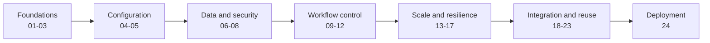

## How The Track Works

This track turns the numbered files under `.github/workflows/` into a
progressive GitHub Actions curriculum. Each lesson has the same basename as its
workflow, with `.md` replacing `.yml`.

Run exercises from your own fork. Some lessons require repository settings,
environments, variables, secrets, external repositories, or Azure resources
that learners should not configure in the source repository.

The sequence moves from events and jobs through governance, data flow,
resilience, reusable workflows, and finally an opt-in Azure deployment.

## Prerequisites

* A fork of this repository with GitHub Actions enabled
* Permission to create branches and manually run workflows in the fork
* Repository administration access for exercises that use environments,
  variables, secrets, reusable-workflow access, or OIDC
* An Azure subscription only for the opt-in Workflow 24 deployment lesson

## Codespaces Preparation

Complete the [Codespaces setup and lifecycle guide](../docs/codespaces-guide.md)
before Workflow 01. Create the Codespace from your fork and confirm `origin`
and `gh repo view` identify that fork. Open its **Actions** tab and accept the
fork workflow enablement prompt before attempting a manual run.

The Codespace supplies authoring tools and GitHub CLI. GitHub-hosted runners
execute the workflows after changes are committed and pushed. A new manual
workflow must contain `workflow_dispatch` on the default branch before GitHub
shows **Run workflow**. Scheduled workflows also use the default branch.

Workflows 04, 05, and 24 require repository administration that a Codespace
cannot grant. Workflows 22 and 23 require additional repository or enterprise
topology. Confirm these permissions before reaching each checkpoint rather than
placing credentials or policy workarounds in the Codespace.

## Exercise Catalog

| Index | Lesson | Concept | Setup And Risk |
| --- | --- | --- | --- |
| 01 | [Basic Triggers](01-basic-triggers-workflow.md) | Push, pull request, schedule, and manual events | Low; scheduled runner use |
| 02 | [Script Runners](02-list-dir-with-python-workflow.md) | Checked-in PowerShell and inline Python | Low; repository scripts execute |
| 03 | [Multiple Jobs](03-multiple-jobs-workflow.md) | Independent jobs and parallel eligibility | Low; two runners |
| 04 | [Environments](04-environments-workflow.md) | Environment gates, variables, and secrets | Medium; settings required |
| 05 | [Repository Values](05-repo-values-workflow.md) | Repository and environment values with job ordering | Medium; secrets and environments |
| 06 | [Artifacts](06-artifacts-workflow.md) | Upload, retention, download, and dependent jobs | Medium; retained run data |
| 07 | [Permissions](07-permissions-workflow.md) | Least-privilege `GITHUB_TOKEN` | Low |
| 08 | [Timeouts](08-timeouts-workflow.md) | Automatic cancellation of long jobs | Low; five runner-minutes |
| 09 | [Manual Inputs](09-manual-inputs-workflow.md) | Typed dispatch inputs and choices | Low |
| 10 | [Dynamic Run Names](10-show-commit-workflow.md) | Identifiable workflow runs | Low |
| 11 | [Event Filters](11-event-filters-workflow.md) | Branch, path, and activity filtering | Low; inspect before enabling triggers |
| 12 | [Job Outputs](12-job-outputs-workflow.md) | Passing metadata through `needs` | Low |
| 13 | [Matrix Strategy](13-matrix-workflow.md) | Cross-platform job expansion | Medium; three runners |
| 14 | [Error Handling](14-error-handling-workflow.md) | Experimental failures and `continue-on-error` | Medium |
| 15 | [Dependency Cache](15-dependency-cache-workflow.md) | Restore/save cache lifecycle | Medium; cache storage |
| 16 | [Concurrency](16-concurrency-workflow.md) | Canceling superseded runs | Medium; intentional wait |
| 17 | [Run Defaults](17-run-defaults-workflow.md) | Workflow-level shell defaults | Low |
| 18 | [Service Containers](18-service-containers-workflow.md) | Redis health checks and runner networking | Medium; container image |
| 19 | [Reusable Definition](19-called-workflow.md) | Typed `workflow_call` contract | Medium |
| 20 | [First Local Caller](20-caller-workflow.md) | Local reusable workflow invocation | Medium |
| 21 | [Second Local Caller](21-caller-workflow.md) | Reusing one contract with different defaults | Medium |
| 22 | [Same-Organization Caller](22-caller-workflow.md) | Cross-repository reusable call | High; external caller repository |
| 23 | [Same-Enterprise Caller](23-caller-workflow.md) | Cross-organization reusable call | High; enterprise policy |
| 24 | [Azure Deployment](24-deploy-resources-workflow.md) | GitHub OIDC and Terraform plan/apply | High; billable resources |

## Navigation And Safety

* Follow the index unless a lesson explicitly identifies itself as optional.
* Workflows 22 and 23 are inspection and copy templates. Run them from the
  external caller topology described in their lessons.
* Workflow 24 is opt-in. Its pre-provisioned state storage remains billable and
  contains sensitive state; apply creates additional persistent resources.
* Never paste credentials into workflow files, logs, Issues, or Discussions.
* Complete each lesson's cleanup before moving to an unrelated repository or subscription.
